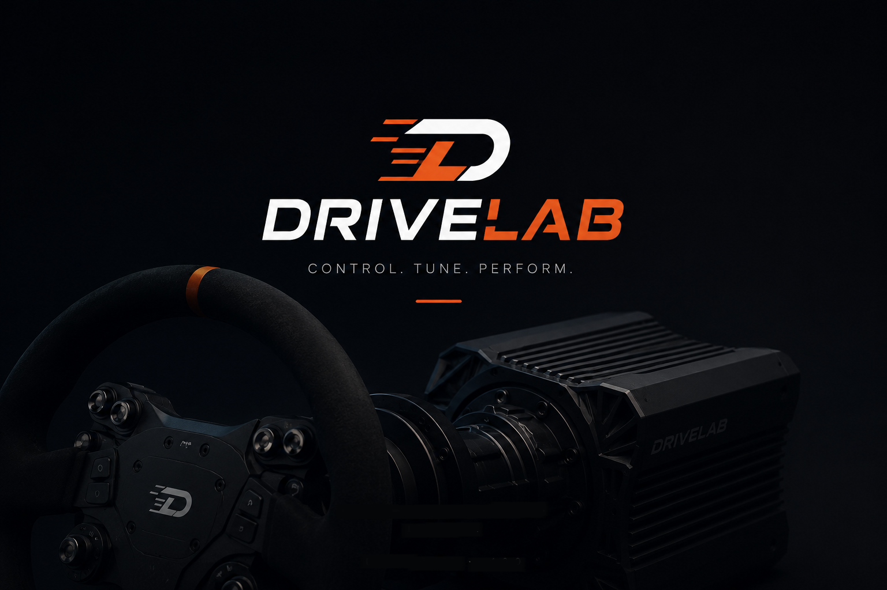
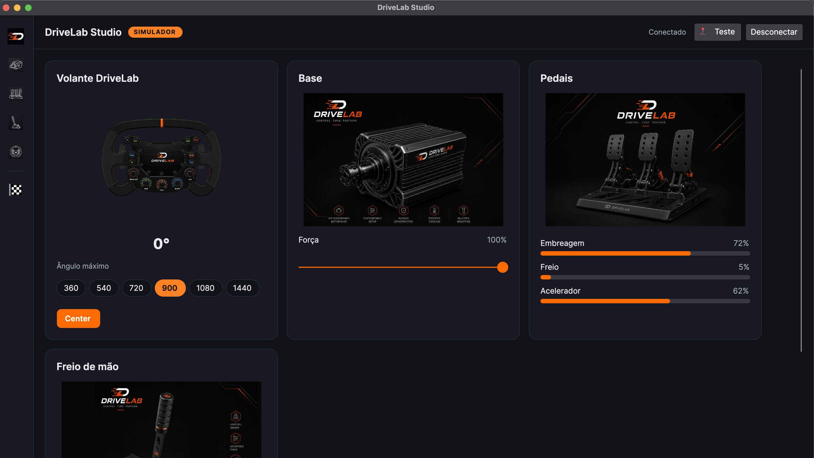
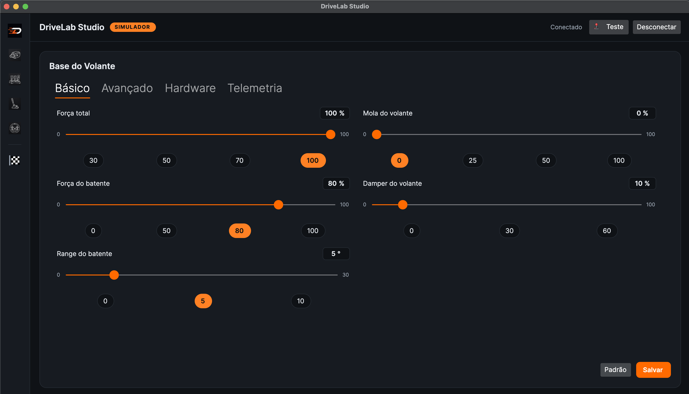
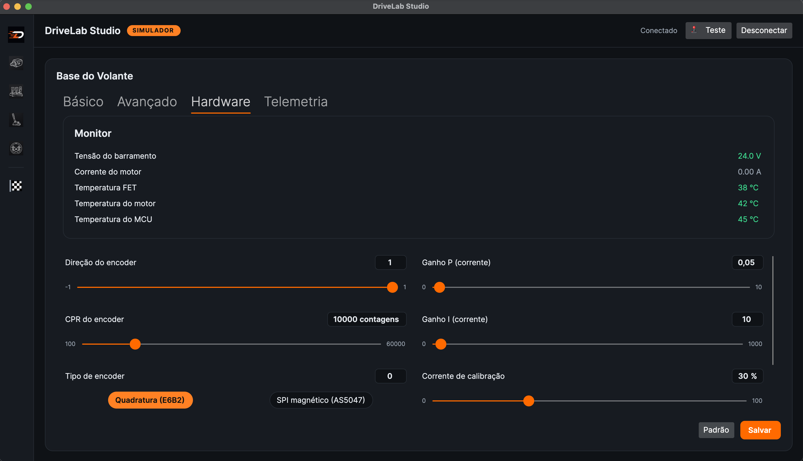
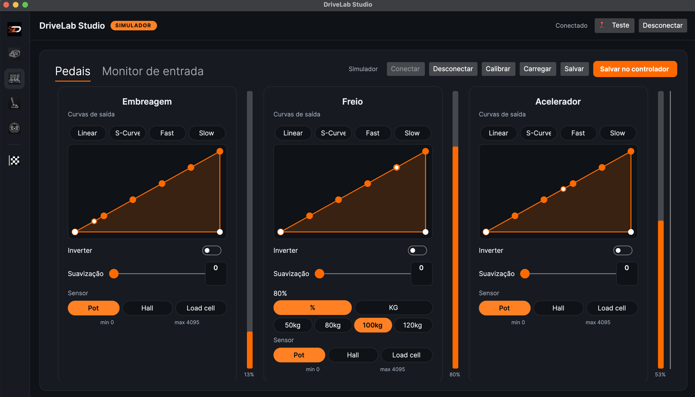
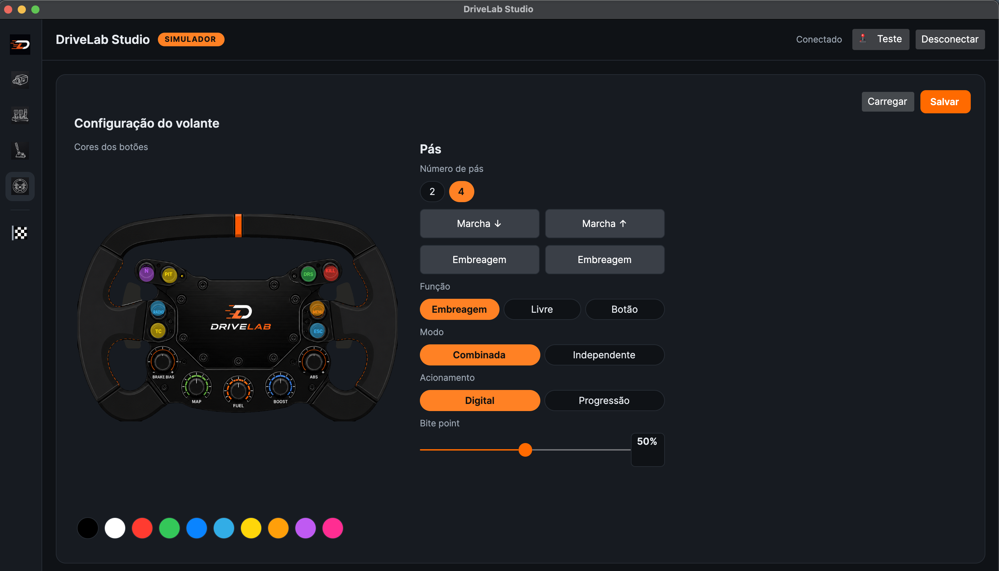
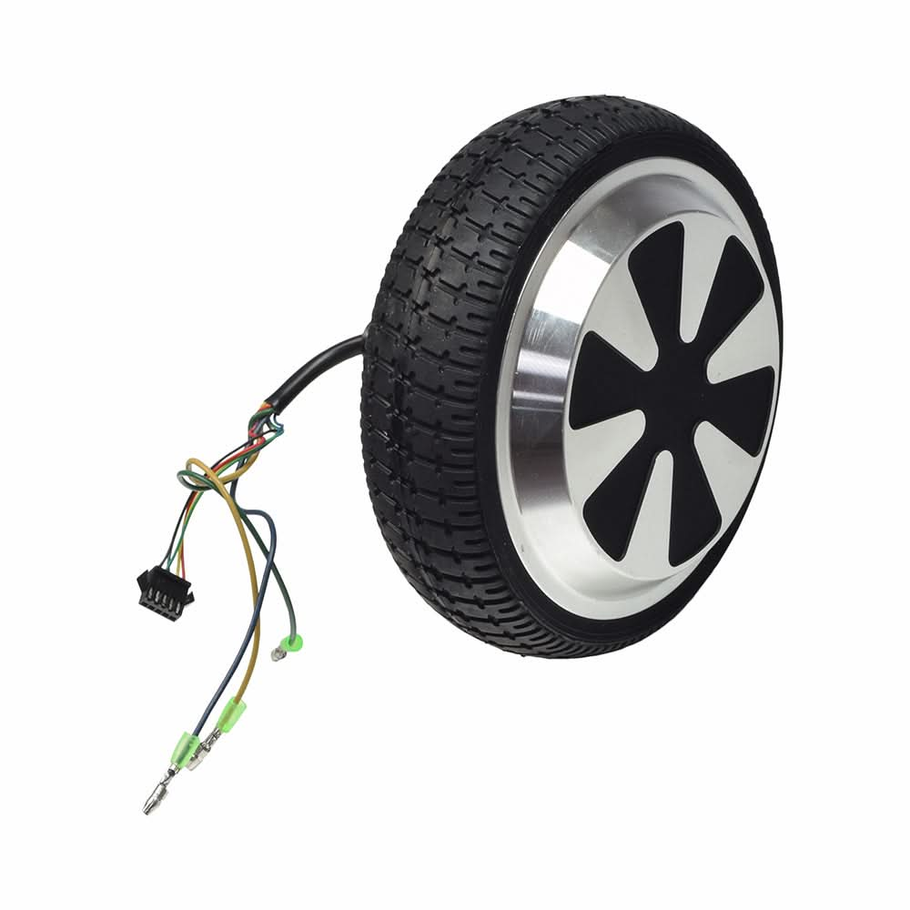
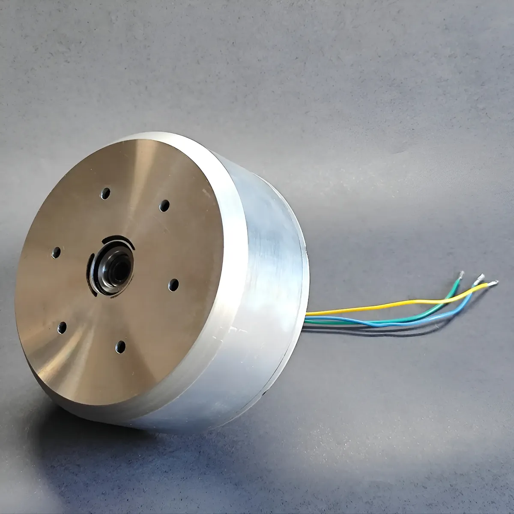
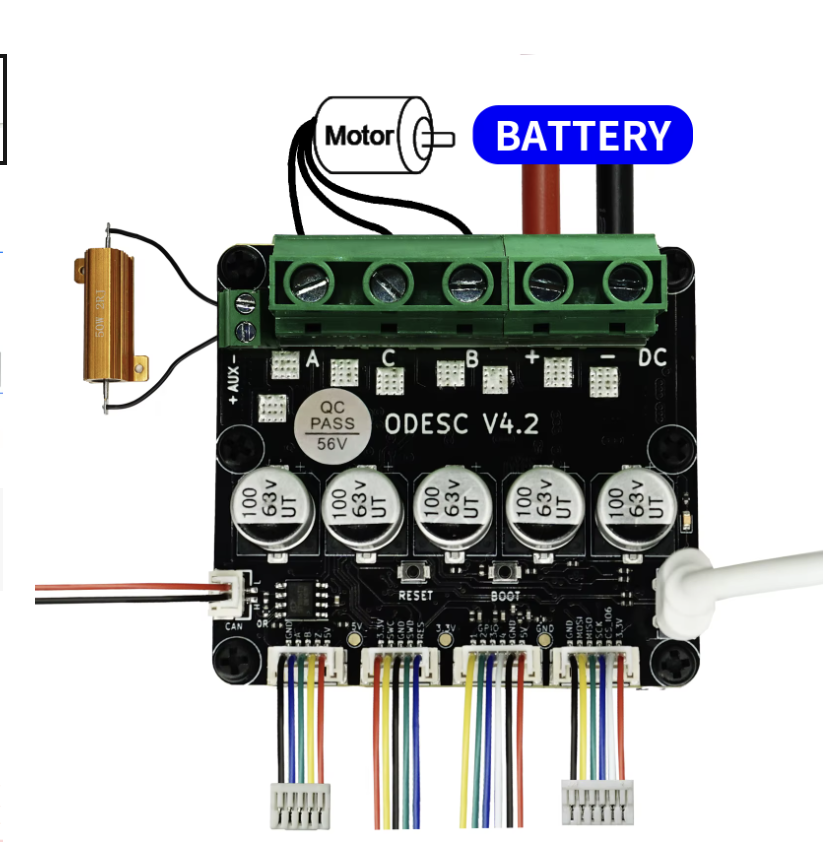
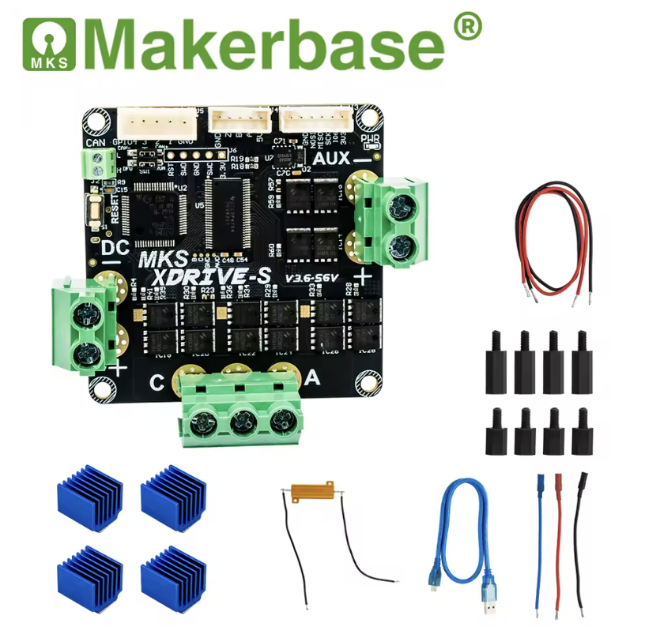

<p align="center">
  
</p>

<h1 align="center">DriveLab</h1>

<p align="center"><b>Open-source Direct-Drive sim-racing wheel</b><br/>
Custom firmware for the ODESC v4.2 + a cross-platform configurator app.</p>

<p align="center">
  <a href="https://discord.gg/Xp2pGm5wj"></a>
  
  
  
  
</p>

<p align="center">
  <a href="#-english">🇬🇧 English</a> &nbsp;·&nbsp; <a href="#-português">🇧🇷 Português</a> &nbsp;·&nbsp; <a href="#-download--baixar">⬇️ Download</a> &nbsp;·&nbsp; <a href="https://discord.gg/Xp2pGm5wj">💬 Discord</a>
</p>

---

## ⬇️ Download / Baixar

**🇬🇧 [Download the latest DriveLab Studio for Windows](https://github.com/lucianotome1970/drivelab/releases/latest)** — a self-contained `.exe`, no .NET install needed. Early **pre-release** for testing. It isn't code-signed, so Windows SmartScreen will warn: **More info → Run anyway**. To explore without hardware, run `DriveLab.Studio.exe --simulator`.

**🇧🇷 [Baixar o DriveLab Studio mais recente para Windows](https://github.com/lucianotome1970/drivelab/releases/latest)** — um `.exe` self-contained, sem instalar .NET. **Pre-release** inicial para testes. Não é assinado, então o SmartScreen do Windows vai avisar: **Mais informações → Executar assim mesmo**. Para explorar sem hardware, rode `DriveLab.Studio.exe --simulator`.

> All builds live on the [releases page](https://github.com/lucianotome1970/drivelab/releases). · *Todas as versões ficam na [página de releases](https://github.com/lucianotome1970/drivelab/releases).*

---

## 📸 Screenshots

<p align="center"></p>

**Home** — overview dashboard: the Wheel, Base, Pedals and Handbrake cards with live values (wheel angle, base force, live pedal bars) plus steering-rotation presets and the **Center** button.
<br/>🇧🇷 *Painel inicial: cartões do Volante, Base, Pedais e Freio de mão com valores ao vivo (ângulo do volante, força da base, barras dos pedais) + presets de rotação e o botão **Center**.*

<p align="center"></p>

**Wheel Base → Basic** — everyday force-feedback tuning: total force, soft-stop force/range, wheel spring and damper, each with a slider and quick presets.
<br/>🇧🇷 *Base do Volante → Básico: ajuste de FFB do dia a dia — força total, força/range do batente, mola e damper do volante, cada um com slider e presets rápidos.*

<p align="center"></p>

**Wheel Base → Hardware** — the read-only **telemetry monitor** (bus voltage, motor current, FET/motor/MCU temperatures) sits above the hardware setup: encoder direction/CPR, **encoder type** (quadrature E6B2 or magnetic SPI AS5047), current-loop P/I gains and calibration current.
<br/>🇧🇷 *Base do Volante → Hardware: o **monitor de telemetria** (tensão do barramento, corrente do motor, temperaturas FET/motor/MCU) fica acima da configuração de hardware — direção/CPR do encoder, **tipo de encoder** (quadratura E6B2 ou SPI magnético AS5047), ganhos P/I da malha de corrente e corrente de calibração.*

<p align="center"></p>

**Pedals** — per-pedal output curves (Linear / S-Curve / Fast / Slow) with a draggable curve editor, invert, smoothing and sensor type (pot / hall / load cell); the brake adds a load-cell target in % or kg. Live input bars on the right.
<br/>🇧🇷 *Pedais: curvas de saída por pedal (Linear / S-Curve / Fast / Slow) com editor de curva arrastável, inverter, suavização e tipo de sensor (pot / hall / load cell); o freio adiciona alvo de load cell em % ou kg. Barras de entrada ao vivo à direita.*

<p align="center"></p>

**Wheel** — customize the rim button **LED colors** and configure the paddles: number of paddles, per-paddle function (shift / clutch / free / button), combined vs independent clutch, digital vs progressive engagement, and bite point.
<br/>🇧🇷 *Volante: personalize as **cores dos LEDs** dos botões do aro e configure as pás — número de pás, função por pá (marcha / embreagem / livre / botão), embreagem combinada vs independente, acionamento digital vs progressivo, e bite point.*

---

## ⚙️ The motor / O motor

The direct-drive actuator is a **cheap hoverboard hub motor**. Buy a spare 6.5" hoverboard wheel, strip the tire, and mount the bare hub to your rig — the machined face is where the wheel adapter bolts on.

🇧🇷 *O atuador direct-drive é um **hub motor de hoverboard barato**. Compre uma roda de hoverboard 6,5", tire o pneu e monte o hub nu na sua estrutura — a face usinada é onde o adaptador do volante parafusa.*

<table>
<tr>
<td width="50%" valign="top">
<br/>
<b>As bought</b> — a 6.5" hoverboard wheel (3 phase wires + hall sensor). · <em>Como vem — roda de hoverboard 6,5" (3 fios de fase + sensor hall).</em>
</td>
<td width="50%" valign="top">
<br/>
<b>Tire removed</b> — the bare hub motor: mounting face + axle, ready for the build. · <em>Sem o pneu — o hub motor nu: face de fixação + eixo, pronto pra montar.</em>
</td>
</tr>
</table>

---

## 🔌 Base board / Placa base

The wheelbase (the FFB motor stage) runs on any **STM32F405 ODrive-class controller** — the firmware is the same for all of them. Two proven, interchangeable options (both **F405, 8–56 V, native USB**):

🇧🇷 *A base (o estágio do motor FFB) roda em qualquer **controladora F405 classe-ODrive** — o firmware é o mesmo. Duas opções comprovadas e intercambiáveis (ambas **F405, 8–56 V, USB nativo**):*

<table>
<tr>
<td width="50%" valign="top">
<br/>
<b>ODESC v4.2</b> — 24 V or 56 V variant · ~70 A / 120 A peak · ships with a brake resistor.<br/>
Wiring: motor → <code>A/B/C</code>, supply → <code>DC +/−</code>, brake resistor → <code>AUX</code>.<br/>
<em>🇧🇷 Variante 24 V ou 56 V · ~70 A / 120 A de pico · já vem com brake resistor. Ligação: motor → <code>A/B/C</code>, alimentação → <code>DC +/−</code>, brake resistor → <code>AUX</code>.</em>
</td>
<td width="50%" valign="top">
<br/>
<b>MKS XDrive-S</b> — 12–56 V · 60 A / 120 A peak · same F405 MCU, so a drop-in alternative · ships with heatsinks + brake resistor.<br/>
<em>🇧🇷 12–56 V · 60 A / 120 A de pico · mesmo MCU F405, então é uma alternativa drop-in · já vem com dissipadores + brake resistor.</em>
</td>
</tr>
</table>

> Any F405 ODrive-class board works (ODESC, MKS XDrive, ODrive v3.6…). The MKS **XDrive MINI** adds an onboard AS5047P encoder, but on a hub motor you usually mount an external encoder on the shaft anyway. · *Qualquer placa F405 classe-ODrive serve (ODESC, MKS XDrive, ODrive v3.6…). A **XDrive MINI** traz um AS5047P onboard, mas num hub motor você normalmente usa um encoder externo no eixo.*

---

## 🎛️ Firmware modules / Módulos de firmware

DriveLab is split into independent firmwares — one per device, each with its own README. The Studio app connects to each over USB HID and auto-detects it by VID/PID.

🇧🇷 *O DriveLab é dividido em firmwares independentes — um por dispositivo, cada um com seu README. O app Studio conecta a cada um via USB HID e os autodetecta por VID/PID.*

- **[Wheelbase / Base »](firmware-base/README.md)** — ODESC v4.2 · STM32F405 · the FFB motor stage (SimpleFOC). *Draft (M0/M0.5), no hardware yet.*
  <br/>🇧🇷 *Estágio do motor FFB (ODESC/STM32F405). Rascunho (M0/M0.5), ainda sem hardware.*
- **[Pedals / Pedaleira »](firmware-pedal/README.md)** — RP2040 · 3 axes · load cell (HX711) · **P0** protocol. **✅ Validated on hardware.**
  <br/>🇧🇷 *RP2040, 3 eixos, load cell (HX711), protocolo **P0**. **✅ Validado em hardware.***
- **[Handbrake / Freio de mão »](firmware-handbrake/README.md)** — RP2040 · 1 axis + button · **P0** protocol. **✅ Validated on hardware** (physical sensor still to test).
  <br/>🇧🇷 *RP2040, 1 eixo + botão, protocolo **P0**. **✅ Validado em hardware** (falta testar com sensor físico).*
- **[Rim / Volante »](firmware-wheel/README.md)** — RP2040 · gamepad (buttons + paddles) · WS2812 LEDs · **P0**. *Written, awaiting bench validation.*
  <br/>🇧🇷 *RP2040, gamepad (botões + pás), LEDs WS2812, **P0**. Escrito, aguardando validação na bancada.*

---

## 🇬🇧 English

### What is DriveLab?

DriveLab turns cheap, widely-available parts — an **ODESC v4.2** motor controller and a **hoverboard hub motor** — into a real **Direct-Drive force-feedback steering wheel** for sim racing (Assetto Corsa Competizione, iRacing, rFactor 2, Automobilista 2, and any DirectInput title).

It is a fully open alternative to closed solutions like FFBeast, with two halves:

- **DriveLab Studio** — a desktop app (.NET 8 / Avalonia) to configure and monitor the wheel. Runs on Windows, and on macOS/Linux for development.
- **DriveLab Firmware** — firmware for the ODESC v4.2 board that enumerates as a standard DirectInput force-feedback wheel and drives the motor with [SimpleFOC](https://simplefoc.com).

> ⚠️ **Status: in active development.** The app is functional (with a hardware simulator you can use today, no board required). The firmware is in bring-up. See the [Roadmap](#roadmap).

### Features

**App (DriveLab Studio)**
- Clean, modern UI with **Wheel Base**, **Pedals**, **Handbrake**, and **Wheel** (rim/LEDs) modules.
- Live **settings** grouped in tabs (Basic / Advanced / Hardware) — total force, damper, spring, soft-stop, torque & power limits, encoder config, current loop, etc. Auto-load on connect, auto-save on change.
- **Telemetry monitor** in the Hardware tab: bus voltage + FET/motor/MCU temperatures + motor current, with ok/warning/critical thresholds.
- **Two encoder types supported** — you choose which one you built: incremental **quadrature** (Omron E6B2) or absolute **magnetic SPI** (AS5047). Absolute keeps its zero across power cycles.
- **Simulator mode** — a virtual wheel with real physics, so you can develop and test the whole UI without any hardware.
- Bilingual (English / Portuguese), auto-detected from the OS.

**Firmware**
- Enumerates as a **DirectInput FFB wheel** — games send force feedback to it exactly like they would to any commercial wheel, no plugin needed.
- **SimpleFOC** field-oriented control of the hub motor.
- Multi-stage safety: brake resistor, current/torque limits, soft-stop, over-voltage cutoff.
- Companion firmware for **pedals** and **handbrake** modules (RP2040 + HX711 load cell).

### Hardware (bill of materials)

| Part | Notes |
|------|-------|
| **ODESC v4.2** or **MKS XDrive** (STM32F405) | Any F405 ODrive-class board — see [Base board](#-base-board--placa-base). ODESC comes in **24 V** (35 V caps → keep the bus ≤ ~24 V) and **56 V** (63 V caps → up to 56 V); MKS XDrive is 12–56 V. Match the PSU to your board. Running a **56 V board on a lower supply (e.g. 24 V) leaves extra headroom** against regen voltage spikes. |
| **Hoverboard hub motor** | The direct-drive actuator. |
| **Encoder** | Incremental Omron E6B2-CWZ6C **or** absolute magnetic AS5047P/MT6701 — your choice. |
| **Brake resistor 2 Ω / 100 W** | **Mandatory** before closed loop — dissipates regen energy so it doesn't destroy the caps. |
| **PSU** | Match your ODESC variant: **≤24 V** for the 24 V board, **up to 56 V** for the 56 V board. Example: 24 V / 30 A (720 W). |
| ST-Link V2 | To flash the STM32 (or DFU). |
| *(optional)* RP2040 + HX711 load cell | For the pedals / handbrake modules. |

### How force feedback works

The game does **not** send telemetry — it sends the **already-computed force**:

```
Game physics (ACC/iRacing)  →  one torque value for the wheel  (~360–400 Hz)
        ↓  DirectInput / HID PID  (Windows)
        ↓  USB
Firmware (ArduinoJoystickWithFFBLibrary.getForce)  →  force  [-255..255]
        ↓  SimpleFOC
Motor torque  →  you feel it
```

Condition effects (spring/damper) are computed on the device from the **encoder** position/velocity; your Studio settings (gain, damper, filters) shape the result before it reaches the motor.

### Repository layout

```
app/                 DriveLab Studio (.NET 8 / Avalonia) + Core, Hid, Simulator, tests
firmware-base/       Wheelbase firmware — ODESC v4.2 / STM32F405, the FFB motor (PlatformIO)  [LGPL-3.0]
firmware-pedal/      Pedals firmware — RP2040 + HX711                                        [MIT]
firmware-handbrake/  Handbrake firmware — RP2040 + HX711                                     [MIT]
firmware-wheel/      Rim firmware — RP2040 (Waveshare Zero): gamepad + WS2812 LEDs (PlatformIO)  [MIT]
tools/HidDump/       HID protocol debug tool
docs/                Design specs & implementation plans
```

### Getting started

**Run the app (with the simulator — no hardware needed):**

```bash
# needs the .NET 8 SDK
cd app
dotnet run --project DriveLab.Studio -- --simulator
```

**Build & test:**

```bash
./scripts/build.sh    # or scripts/build.ps1 on Windows
./scripts/test.sh     # 264 tests
```

**Ship a Windows build** (self-contained single-file `.exe`, no .NET needed on the target):

```bash
./scripts/publish-win.sh   # or scripts/publish-win.ps1 on Windows
# output: dist/win-x64/DriveLab.Studio.exe
```

**Flash the firmware** (needs [PlatformIO](https://platformio.org)): open `firmware-base/` and start at milestone **M0** (serial only, no motor) — see `firmware-base/README.md`.

### Roadmap

`M0` toolchain/serial → `M0.5` USB FFB enumeration → `M1` open-loop motor → `M2` encoder + closed loop + brake resistor → `M2.5` telemetry → `M3` app ↔ firmware link → `M4` settings → `M5` FFB force → motor → `M6` game effects → `M7` sim validation. Details in `docs/`.

### ⚠️ Safety

- **Match the supply to your ODESC variant:** the **24 V board** must stay at ~24 V (35 V caps); the **56 V board** takes up to 56 V (63 V caps). **Never exceed your board's rating.** A 56 V board run on a 24 V supply has comfortable headroom.
- The **2 Ω brake resistor is mandatory** before any closed-loop torque; regen braking pushes energy back onto the bus and will destroy the capacitors without it.
- `M0`/`M0.5` run **with no motor connected**. Bring current up gradually. A direct-drive wheel has enough torque to hurt your wrist — keep an e-stop (the plug) within reach.

### License

- **App + libraries + tools + pedal/handbrake firmware:** [MIT](https://opensource.org/licenses/MIT).
- **Base (wheelbase) firmware** (`firmware-base/`): **LGPL-3.0** — it links the LGPL libraries `USBLibrarySTM32` + `ArduinoJoystickWithFFBLibrary`.

Every source file carries a header stating its license.

### Community & contributing

Questions, build logs, help getting your board running — **join the Discord**: **https://discord.gg/Xp2pGm5wj**

Issues and pull requests are welcome. New source files should include the standard DriveLab header.

---

## 🇧🇷 Português

### O que é o DriveLab?

O DriveLab transforma peças baratas e fáceis de achar — uma controladora **ODESC v4.2** e um **motor de roda de hoverboard** — num verdadeiro **volante Direct-Drive com force feedback** para simuladores (Assetto Corsa Competizione, iRacing, rFactor 2, Automobilista 2 e qualquer título DirectInput).

É uma alternativa totalmente aberta a soluções fechadas como o FFBeast, com duas metades:

- **DriveLab Studio** — um app desktop (.NET 8 / Avalonia) para configurar e monitorar o volante. Roda no Windows, e no macOS/Linux para desenvolvimento.
- **DriveLab Firmware** — firmware para a placa ODESC v4.2 que se apresenta como um volante DirectInput de force feedback padrão e aciona o motor com [SimpleFOC](https://simplefoc.com).

> ⚠️ **Status: em desenvolvimento ativo.** O app já funciona (com um simulador de hardware que você usa hoje, sem placa). O firmware está em bring-up. Veja o [Roadmap](#roadmap-1).

### Recursos

**App (DriveLab Studio)**
- Interface limpa e moderna com os módulos **Base do Volante**, **Pedais**, **Freio de mão** e **Volante** (aro/LEDs).
- **Ajustes** ao vivo em abas (Básico / Avançado / Hardware) — força total, damper, mola, soft-stop, limites de torque e potência, config do encoder, malha de corrente, etc. Carrega ao conectar, salva ao alterar.
- **Monitor de telemetria** na aba Hardware: tensão do barramento + temperaturas FET/motor/MCU + corrente do motor, com limiares ok/alerta/crítico.
- **Dois tipos de encoder suportados** — você escolhe qual construiu: **quadratura** incremental (Omron E6B2) ou **SPI magnético** absoluto (AS5047). O absoluto mantém o zero mesmo desligando.
- **Modo simulador** — um volante virtual com física real, para desenvolver e testar toda a UI sem hardware nenhum.
- Bilíngue (Português / Inglês), detectado automaticamente pelo sistema.

**Firmware**
- Se apresenta como **volante FFB DirectInput** — os jogos mandam force feedback pra ele igualzinho a qualquer volante comercial, sem plugin.
- Controle **SimpleFOC** (orientado a campo) do motor.
- Segurança em múltiplos estágios: brake resistor, limites de corrente/torque, soft-stop, corte por sobretensão.
- Firmwares companheiros para os módulos de **pedais** e **freio de mão** (RP2040 + célula de carga HX711).

### Hardware (lista de materiais)

| Peça | Observações |
|------|-------------|
| **ODESC v4.2** ou **MKS XDrive** (STM32F405) | Qualquer placa F405 classe-ODrive — ver [Placa base](#-base-board--placa-base). A ODESC vem em **24 V** (caps 35 V → manter ~24 V) e **56 V** (caps 63 V → até 56 V); a MKS XDrive é 12–56 V. Case a fonte com a sua placa. Usar uma **placa 56 V numa fonte mais baixa (ex.: 24 V) dá folga extra** contra picos de regen. |
| **Motor de roda de hoverboard** | O atuador direct-drive. |
| **Encoder** | Omron E6B2-CWZ6C incremental **ou** magnético absoluto AS5047P/MT6701 — sua escolha. |
| **Brake resistor 2 Ω / 100 W** | **Obrigatório** antes da malha fechada — dissipa a energia de frenagem regenerativa para não destruir os capacitores. |
| **Fonte** | Casar com a sua variante de ODESC: **≤24 V** na placa 24 V, **até 56 V** na placa 56 V. Ex.: 24 V / 30 A (720 W). |
| ST-Link V2 | Para gravar o STM32 (ou DFU). |
| *(opcional)* RP2040 + célula HX711 | Para os módulos de pedais / freio de mão. |

### Como o force feedback funciona

O jogo **não** manda telemetria — ele manda a **força já calculada**:

```
Física do jogo (ACC/iRacing)  →  um valor de torque pro volante  (~360–400 Hz)
        ↓  DirectInput / HID PID  (Windows)
        ↓  USB
Firmware (ArduinoJoystickWithFFBLibrary.getForce)  →  força  [-255..255]
        ↓  SimpleFOC
Torque no motor  →  você sente
```

Os efeitos de condição (mola/damper) são calculados no dispositivo a partir da posição/velocidade do **encoder**; seus ajustes no Studio (ganho, damper, filtros) moldam o resultado antes de chegar ao motor.

### Estrutura do repositório

```
app/                 DriveLab Studio (.NET 8 / Avalonia) + Core, Hid, Simulator, testes
firmware-base/       Firmware da base — ODESC v4.2 / STM32F405, o motor FFB (PlatformIO)  [LGPL-3.0]
firmware-pedal/      Firmware dos pedais — RP2040 + HX711                                [MIT]
firmware-handbrake/  Firmware do freio de mão — RP2040 + HX711                           [MIT]
firmware-wheel/      Firmware do aro — RP2040 (Waveshare Zero): gamepad + LEDs WS2812 (PlatformIO)  [MIT]
tools/HidDump/       Ferramenta de debug do protocolo HID
docs/                Specs de design & planos de implementação
```

### Primeiros passos

**Rodar o app (com o simulador — sem hardware):**

```bash
# precisa do .NET 8 SDK
cd app
dotnet run --project DriveLab.Studio -- --simulator
```

**Build & testes:**

```bash
./scripts/build.sh    # ou scripts/build.ps1 no Windows
./scripts/test.sh     # 264 testes
```

**Gerar o executável Windows** (self-contained, single-file `.exe`, sem precisar de .NET na máquina alvo):

```bash
./scripts/publish-win.sh   # ou scripts/publish-win.ps1 no Windows
# saída: dist/win-x64/DriveLab.Studio.exe
```

**Gravar o firmware** (precisa do [PlatformIO](https://platformio.org)): abra `firmware-base/` e comece pelo marco **M0** (só serial, sem motor) — veja `firmware-base/README.md`.

### Roadmap

`M0` toolchain/serial → `M0.5` enumeração USB FFB → `M1` motor malha aberta → `M2` encoder + malha fechada + brake resistor → `M2.5` telemetria → `M3` app ↔ firmware → `M4` settings → `M5` força FFB → motor → `M6` efeitos de jogo → `M7` validação no sim. Detalhes em `docs/`.

### ⚠️ Segurança

- **Case a fonte com a sua variante de ODESC:** a **placa 24 V** fica em ~24 V (caps 35 V); a **placa 56 V** aceita até 56 V (caps 63 V). **Nunca ultrapasse o limite da SUA placa.** Uma placa 56 V numa fonte de 24 V tem folga confortável.
- O **brake resistor de 2 Ω é obrigatório** antes de qualquer torque em malha fechada; a frenagem regenerativa devolve energia ao barramento e, sem ele, destrói os capacitores.
- `M0`/`M0.5` rodam **sem motor conectado**. Suba a corrente aos poucos. Um volante direct-drive tem torque pra machucar o pulso — mantenha um e-stop (a tomada) ao alcance.

### Licença

- **App + bibliotecas + ferramentas + firmware de pedal/freio:** [MIT](https://opensource.org/licenses/MIT).
- **Firmware da base (wheelbase)** (`firmware-base/`): **LGPL-3.0** — linca as bibliotecas LGPL `USBLibrarySTM32` + `ArduinoJoystickWithFFBLibrary`.

Todo arquivo-fonte traz um cabeçalho declarando sua licença.

### Comunidade & contribuição

Dúvidas, logs de montagem, ajuda pra pôr sua placa pra rodar — **entre no Discord**: **https://discord.gg/Xp2pGm5wj**

Issues e pull requests são bem-vindos. Arquivos novos devem incluir o cabeçalho padrão do DriveLab.
