<p align="center">
  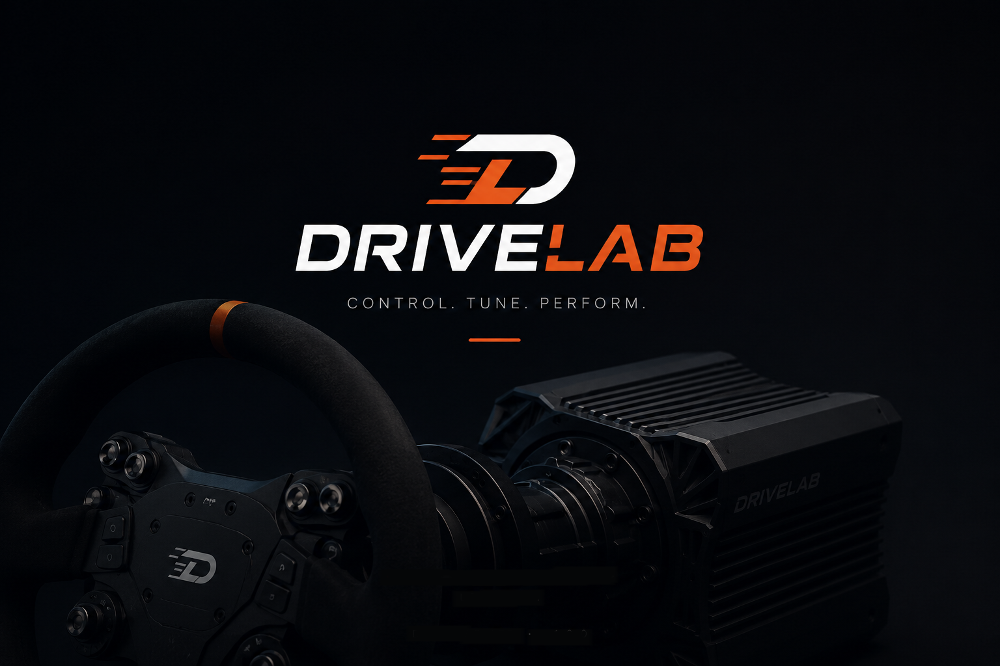
</p>

<h1 align="center">DriveLab</h1>

<p align="center"><b>Volante Direct-Drive de código aberto para simuladores</b><br/>
Firmware próprio para placas classe ODrive v3.6 (validado numa MKS ODRIVE-S V3.6-S6V) + um app configurador multiplataforma.</p>

<p align="center">
  <a href="https://discord.gg/Xp2pGm5wj"></a>
  
  
  
  
</p>

<p align="center">
  <a href="README.md">🇬🇧 Read in English</a> &nbsp;·&nbsp; <a href="#-download">⬇️ Baixar</a> &nbsp;·&nbsp; <a href="https://discord.gg/Xp2pGm5wj">💬 Discord</a>
</p>

---

## ⬇️ Download

**[Baixar o DriveLab Studio mais recente para Windows](https://github.com/lucianotome1970/drivelab/releases/latest)** — um `.exe` self-contained, sem precisar instalar o .NET.

**Pre-release** inicial, para testes. Não é assinado digitalmente, então o SmartScreen do Windows vai avisar: **Mais informações → Executar assim mesmo**. Para explorar sem hardware, rode `DriveLab.Studio.exe --simulator`.

Todas as versões ficam na [página de releases](https://github.com/lucianotome1970/drivelab/releases).

> 🛠️ **Monta e vende DDs?** O **[Guia do criador](docs/guia-criador.md)** mostra como configurar seu hardware e gerar um instalador Windows já com a configuração embutida.

---

## 📸 Telas

<p align="center">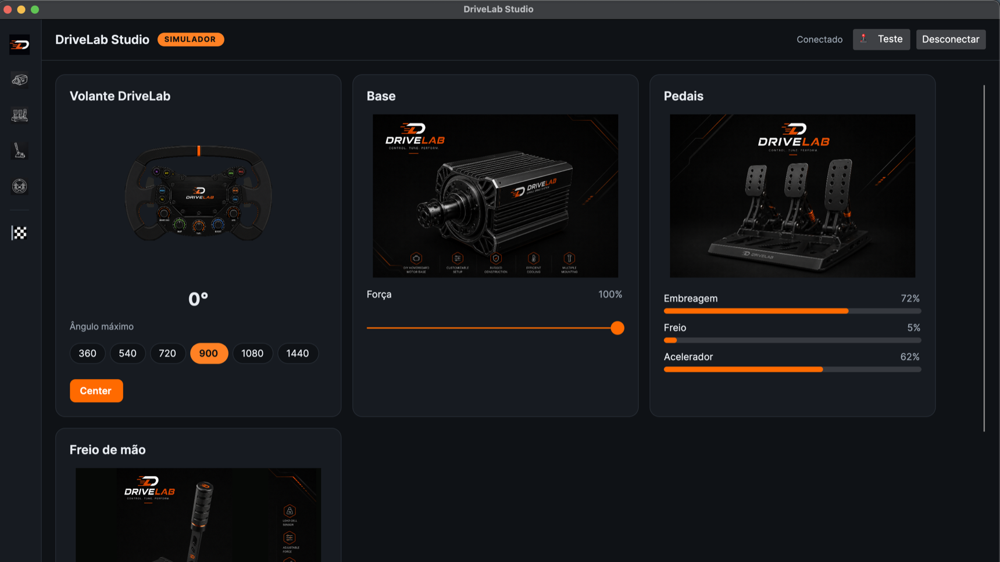</p>

**Painel inicial** — visão geral: cartões do Volante, Base, Pedais e Freio de mão com valores ao vivo (ângulo do volante, força da base, barras dos pedais), mais os presets de rotação e o botão **Center**.

<p align="center">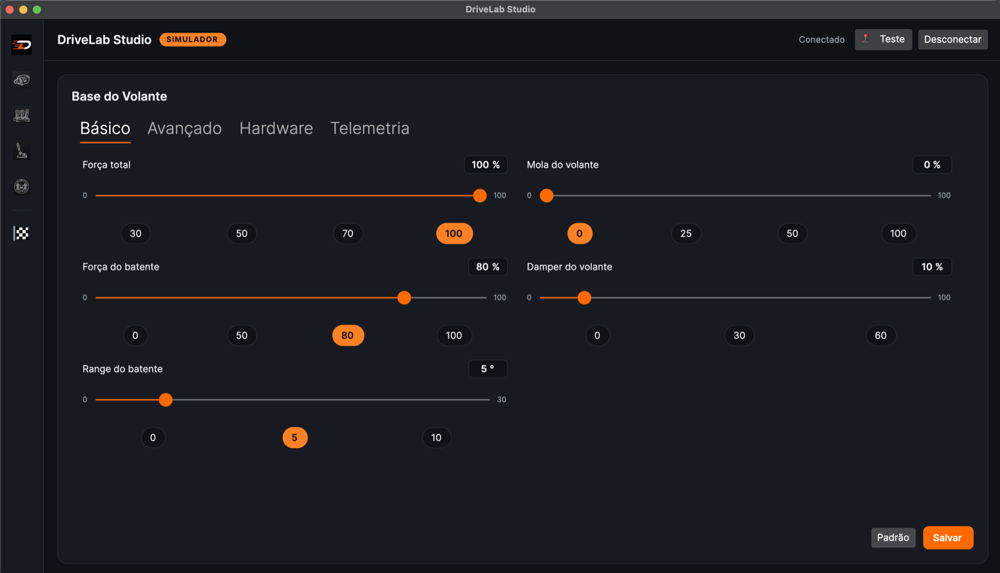</p>

**Base do Volante → Básico** — ajuste de force feedback do dia a dia: força total, força e alcance do batente, mola e damper do volante, cada um com slider e presets rápidos.

<p align="center">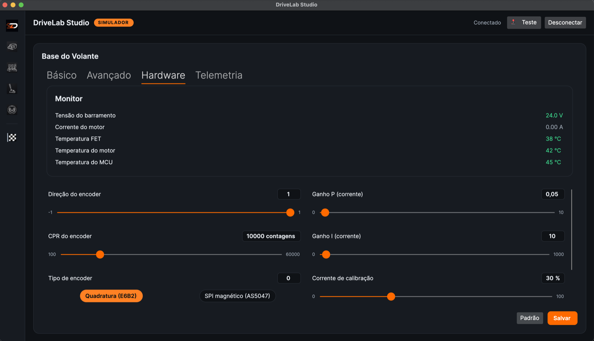</p>

**Base do Volante → Hardware** — o **monitor de telemetria** (tensão do barramento, corrente do motor, temperaturas FET/motor/MCU), somente leitura, fica acima da configuração de hardware: direção e CPR do encoder, **tipo de encoder** (quadratura E6B2 ou magnético SPI AS5047), ganhos P/I da malha de corrente e corrente de calibração.

<p align="center">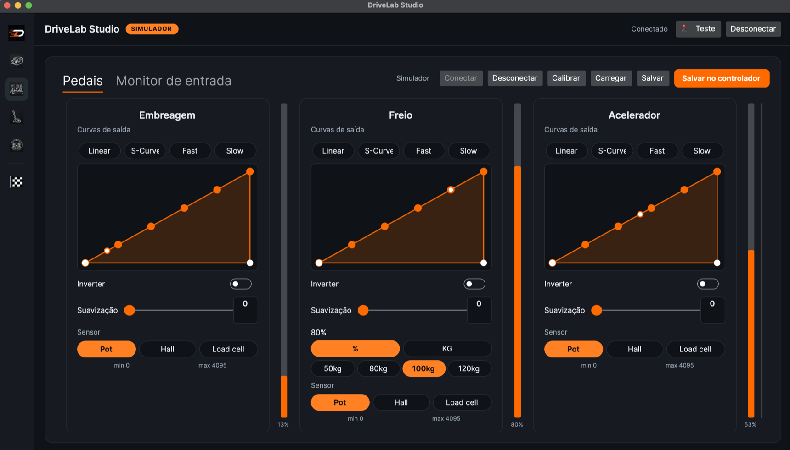</p>

**Pedais** — curvas de saída por pedal (Linear / S-Curve / Fast / Slow) com editor de curva arrastável, inverter, suavização e tipo de sensor (potenciômetro / hall / célula de carga); o freio ganha um alvo de célula de carga em % ou kg. Barras de entrada ao vivo à direita.

<p align="center">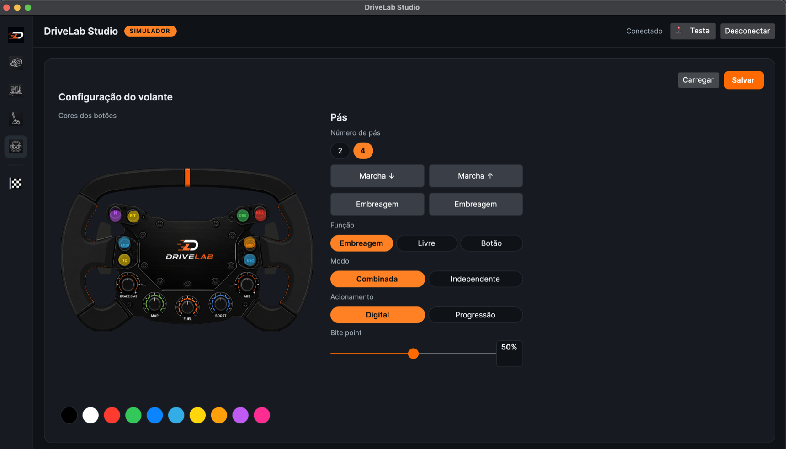</p>

**Volante** — personalize as **cores dos LEDs** dos botões do aro e configure as pás: número de pás, função de cada uma (marcha / embreagem / livre / botão), embreagem combinada ou independente, acionamento digital ou progressivo, e bite point.

---

## ⚙️ O motor

O atuador direct-drive é um **motor de roda de hoverboard, barato**. Compre uma roda de hoverboard de 6,5", tire o pneu e monte o cubo nu na sua estrutura — a face usinada é onde o adaptador do volante parafusa.

<table>
<tr>
<td width="50%" valign="top">
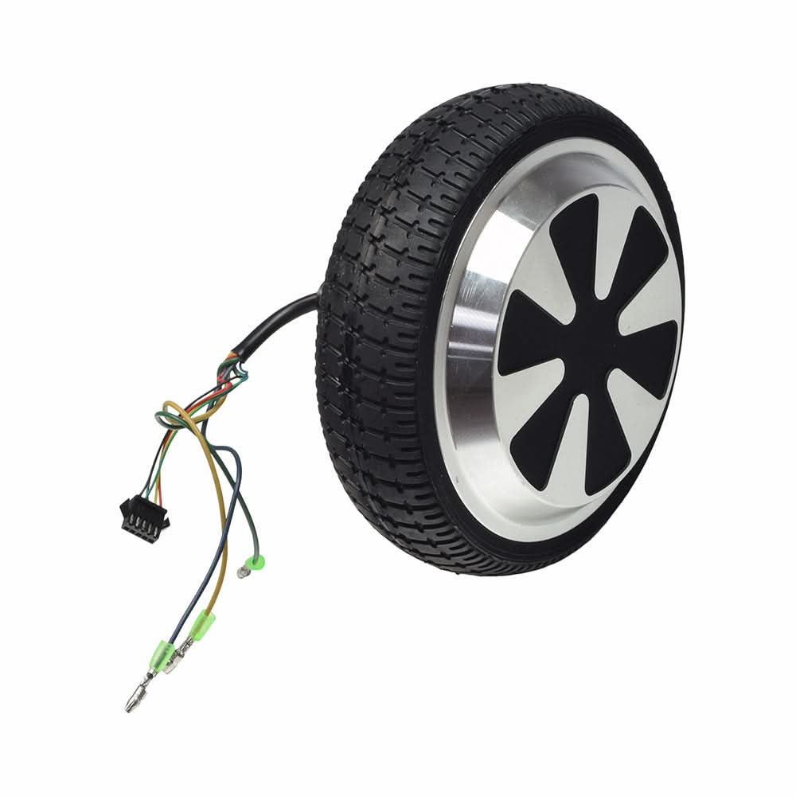<br/>
<b>Como vem</b> — roda de hoverboard de 6,5" (3 fios de fase + sensor hall).
</td>
<td width="50%" valign="top">
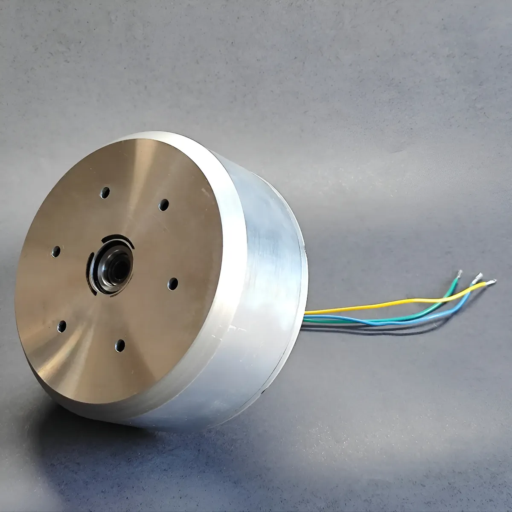<br/>
<b>Sem o pneu</b> — o cubo nu: face de fixação + eixo, pronto pra montar.
</td>
</tr>
</table>

Primeira vez com motor de hoverboard? O **[FAQ da base hoverboard](docs/faq-hoverboard.md)** cobre qual motor comprar, como abrir e preparar ele, e os 25 problemas que mais aparecem.

---

## 🔌 Placa base

A base (o estágio do motor de FFB) roda em qualquer **controladora STM32F405 classe ODrive** — o firmware é o mesmo para todas. Quatro opções comprovadas:

<table>
<tr>
<td width="50%">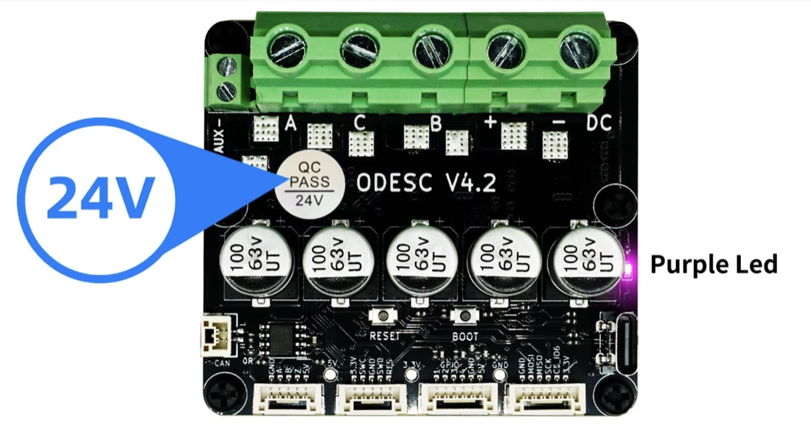</td>
<td width="50%">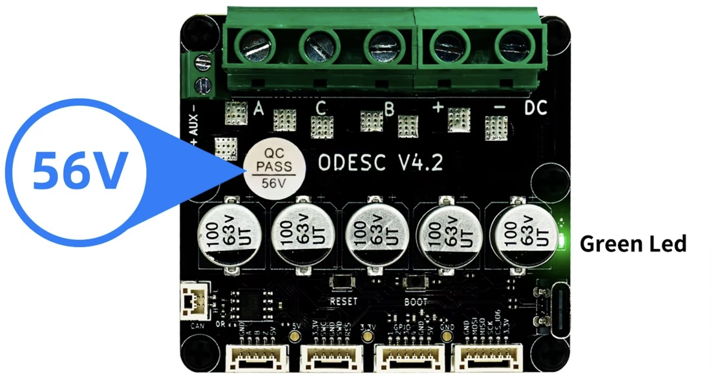</td>
</tr>
<tr>
<td><b>ODESC v4.2 — 8–24 V</b><br/>~70 A / 120 A de pico.<br/>Adesivo <code>QC PASS 24V</code> · LED de status <b>roxo</b>.</td>
<td><b>ODESC v4.2 — 8–56 V</b><br/>~70 A / 120 A de pico.<br/>Adesivo <code>QC PASS 56V</code> · LED de status <b>verde</b>.</td>
</tr>
<tr>
<td>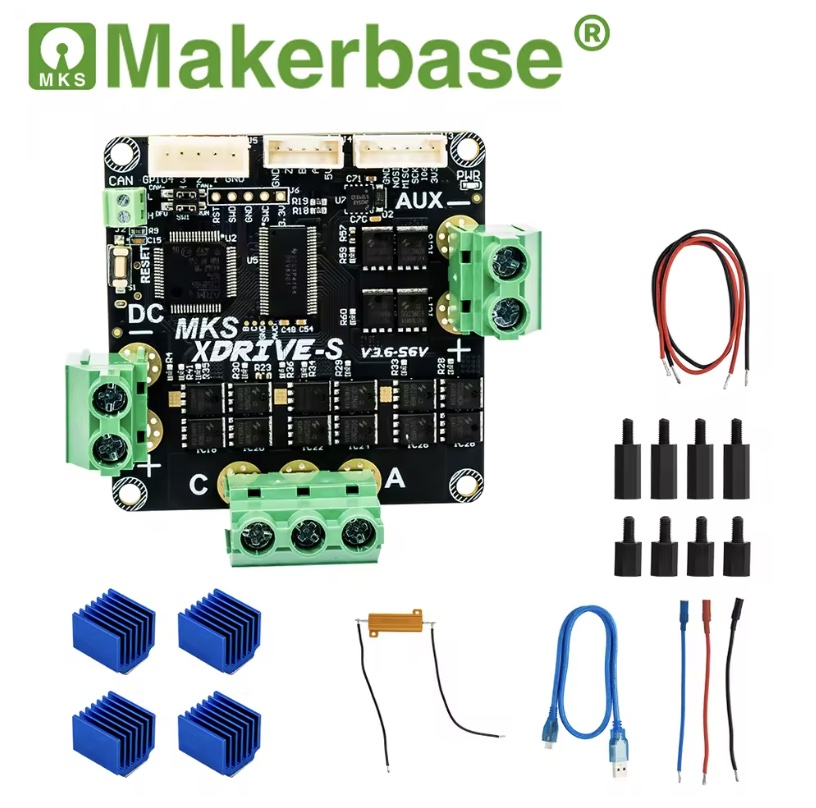</td>
<td>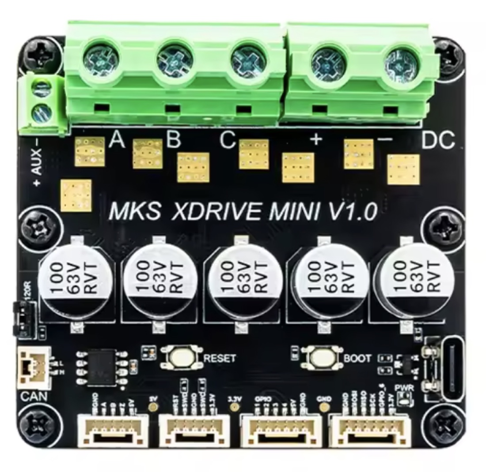</td>
</tr>
<tr>
<td><b>MKS XDrive-S</b> — 12–56 V<br/>60 A / 120 A de pico · já vem com dissipadores.</td>
<td><b>MKS XDrive Mini V1.0</b> — 12–56 V<br/>Mesmo MCU F405, numa placa menor.</td>
</tr>
</table>

**A ligação é a mesma nas quatro** — potência nos bornes de parafuso, sinal nos conectores JST da borda de baixo:

| Ligação | Onde |
|---|---|
| Fases do motor | bornes <code>A</code> / <code>B</code> / <code>C</code> |
| Fonte de alimentação | bornes <code>DC +/−</code> |
| Resistor de freio | <code>AUX +/−</code> |
| **Encoder incremental** (A/B/Z, ex.: Omron E6B2) | conector <code>ABZ</code> — `5V · A · B · Z · GND` |
| **Encoder magnético** (SPI, ex.: MT6835 / AS5047P) | conector <code>SPI</code> — `3,3V · GND · SCK · MISO · MOSI · CS` |
| Debug e gravação | conector <code>SWD</code> — `3,3V · SWDIO · SWCLK · GND · RST` |

Os dois conectores de encoder existem em todas essas placas, então a escolha do sensor não é escolha de placa. O firmware hoje aciona o caminho **incremental A/B/Z**; o suporte a **magnético por SPI** está em andamento — veja o [encoders.md](docs/encoders.md) para escolher qual sensor comprar e por quê.

As duas variantes da ODESC são idênticas fora o adesivo e a cor do LED — os capacitores são de 63 V nas duas, então não dizem nada. Dar na de 24 V mais tensão do que ela aceita destrói a placa.

> ℹ️ O firmware está hoje **fixado no layout da ODrive v3.6** e **validado numa MKS ODRIVE-S V3.6-S6V**. Outras placas F405 classe ODrive compartilham o MCU e o USB, mas uma placa com **pinagem diferente (ex.: ODESC v4.2)** pode exigir remapear os pinos em `firmware-base/vendor/odrive-fw/Board/v3/`.

---

## 🎛️ Módulos de firmware

O DriveLab é dividido em firmwares independentes — um por dispositivo, cada um com seu próprio README. O app Studio conecta em cada um por USB HID e detecta automaticamente pelo VID/PID.

- **[Base »](firmware-base/README.pt.md)** — classe ODrive v3.6 (MKS ODRIVE-S V3.6-S6V) · STM32F405 · o estágio do motor de FFB. *Roda o motor em FOC; caminho do FFB validado com ACC/AMS2/EVO. Efeitos de jogo (M6) na bancada.*
- **[Pedais »](firmware-pedal/README.pt.md)** — RP2040 · 3 eixos · célula de carga (HX711) · protocolo **P0**. **✅ Validado em hardware.**
- **[Freio de mão »](firmware-handbrake/README.pt.md)** — RP2040 · 1 eixo + botão · protocolo **P0**. **✅ Validado em hardware** (falta testar com o sensor físico).
- **[Aro »](firmware-wheel/README.pt.md)** — RP2040 · gamepad (botões + pás) · LEDs WS2812 · **P0**. *Escrito, aguardando validação na bancada.*

O app desktop que conversa com todos eles: **[DriveLab Studio (app) »](app/README.pt.md)** — .NET 8 / Avalonia.

Quer rodar o app na **sua própria placa**? O contrato USB-HID completo está documentado em **[docs/PROTOCOL.md »](docs/PROTOCOL.md)** — implemente ele e o Studio controla o seu hardware, sem mexer no app.

### 📚 Guias

Comece por aqui:

- **[Como funciona](docs/how-it-works.md)** — guia de estudo: como um volante DD funciona, aterrado no DriveLab (motor · encoder · FOC · FFB · segurança).

Guias de hardware e montagem:

- **[FAQ da base hoverboard](docs/faq-hoverboard.md)** — os problemas de montagem mais comuns e o que fazer, organizados por sintoma. Serve para qualquer firmware.
- **[Guia de encoders](docs/encoders.md)** — qual sensor de posição comprar (E6B2 · MT6701 · AS5047P).
- **[Resistor de frenagem](docs/brake-resistor.md)** — por que 2Ω, e a diferença entre os valores de Ω e W.
- **[Soft-power e contator](docs/soft-power-contator.md)** — desligar com segurança, fiação do contator, botão soft-power.
- **[Cálculo de torque](docs/calculo-torque.md)** — dimensionar os Nm do motor.
- **[Guia do criador](docs/guia-criador.md)** — configurar o hardware e gerar um instalador Windows.
- **[Protocolo USB-HID](docs/PROTOCOL.md)** — o contrato completo para usar a sua própria placa.

---

## 🧠 Por que o RP2040?

Os pedais, o freio de mão e o aro rodam numa **Waveshare RP2040-Zero**. O lado do dispositivo precisa ser um **dispositivo USB HID customizado** — um gamepad **mais** um canal vendor (report ids `0x14/0x15/0x16/0x20`) que o app usa para ler e gravar ajustes e receber telemetria. Foi isso que definiu a escolha:

- **USB nativo** no MCU (não uma ponte USB-serial) — necessário para enumerar como um HID de verdade.
- **Controle total do descritor HID** — dado pelo **Adafruit_TinyUSB**, que roda no RP2040. É o que permite definir os reports vendor customizados, não só um gamepad padrão.
- Bastante **GPIO** (eixos, botões, encoders, LEDs WS2812), **USB-C**, dois núcleos, e é **barato** (~US$ 2–5).

**Dá pra usar um Arduino?** Só placas com **USB nativo**: o **Arduino Nano RP2040 Connect** roda praticamente sem mudança (é um RP2040); placas **SAMD21** (Zero, MKR, Nano 33 IoT) precisam de um porte leve (o TinyUSB suporta SAMD); um **ATmega32U4** (Leonardo/Micro/Pro Micro) faz HID, mas por outra pilha USB e com flash/RAM apertados (o canal vendor de ajustes precisaria ser portado). Os clássicos **Uno / Nano / Mega** (ATmega328/2560) **não funcionam** — não têm USB nativo, o chip CH340/FTDI deles é só serial.

> O firmware da base é a exceção — ele mira o **STM32F405** para o motor de FFB, não um RP2040.

---

## O que é o DriveLab?

O DriveLab transforma peças baratas e fáceis de achar — uma controladora **classe ODrive v3.6** (validada numa **MKS ODRIVE-S V3.6-S6V**) e um **motor de roda de hoverboard** — num verdadeiro **volante Direct-Drive com force feedback** para simuladores (Assetto Corsa Competizione, iRacing, rFactor 2, Automobilista 2 e qualquer título DirectInput).

É uma alternativa totalmente aberta a soluções fechadas como o FFBeast, com duas metades:

- **DriveLab Studio** — um app desktop (.NET 8 / Avalonia) para configurar e monitorar o volante. Roda no Windows, e no macOS/Linux para desenvolvimento.
- **DriveLab Firmware** — firmware para a placa classe ODrive v3.6 que se apresenta como um volante DirectInput de force feedback padrão e aciona o motor com controle orientado a campo construído sobre o firmware do [ODrive](https://odriverobotics.com) (vendorizado, MIT).

> ⚠️ **Status: em desenvolvimento ativo.** O app já funciona (com um simulador de hardware, sem precisar de placa). O firmware **roda o motor em FOC** e o **caminho do FFB está validado com jogos reais (ACC 400 Hz, AMS2, EVO)**; o ajuste fino de FFB em pista depende do encoder magnético. Veja o [Roadmap](#roadmap).

## Recursos

**App (DriveLab Studio)**
- Interface limpa e moderna com os módulos **Base do Volante**, **Pedais**, **Freio de mão** e **Volante** (aro/LEDs).
- **Perfis nomeados por módulo** — salvar, aplicar, renomear e excluir perfis (ex.: "GT3", "Chuva") na base, pedais, freio de mão e volante; selecionar um perfil grava no controlador, e o *Salvar* só habilita quando a configuração atual difere do perfil carregado.
- **LEDs do volante** — cores por botão + brilho global; o aro **guarda as cores na flash** (acende sozinho depois de religar) e o app **lê as cores de volta** da placa ao conectar.
- **Ajustes** ao vivo agrupados em abas (Básico / Avançado / **Feel** / Hardware) — força total, damper, mola, batente, **ganhos de FFB por efeito** (mola/damper/atrito/inércia), limites de torque e potência, configuração do encoder, malha de corrente, etc. Carrega ao conectar, salva ao alterar.
- **Monitor de telemetria** na aba Hardware: tensão do barramento + temperaturas FET/motor/MCU + corrente do motor, com limiares ok/alerta/crítico.
- **Três tipos de encoder** — **quadratura** incremental (Omron E6B2, o sensor atual da bancada) ou **magnético** absoluto (MT6701 como padrão planejado · AS5047P planejado). O absoluto mantém o zero mesmo desligando. *(Os drivers magnéticos chegam no Stage 1.)*
- **Modo simulador** — um volante virtual com física real, para desenvolver e testar toda a interface sem hardware nenhum.
- Bilíngue (Português / Inglês), detectado automaticamente pelo sistema.

**Firmware**
- Se apresenta como **volante FFB DirectInput** — os jogos mandam force feedback pra ele igualzinho a qualquer volante comercial, sem plugin.
- **Controle orientado a campo** do motor, construído sobre o firmware do ODrive.
- Segurança em múltiplos estágios: chopper do resistor de freio, limites de corrente e torque, batente, corte por sobretensão, mais **contator off-state e botão soft-power (opt-in)** — base testada no host.
- Firmwares companheiros para os módulos de **pedais** e **freio de mão** (RP2040 + célula de carga HX711).

## Hardware — base do volante (lista de materiais)

Esta é a **base** (o wheelbase direct-drive). Cada outro módulo é um dispositivo USB independente, com a **sua própria** lista de materiais — veja a tabela por módulo abaixo.

| Peça | Observações |
|------|-------------|
| **Placa classe ODrive v3.6** (STM32F405) — validada: **MKS ODRIVE-S V3.6-S6V** | Qualquer placa F405 classe ODrive — veja [Placa base](#-placa-base). **As placas MKS aceitam de 12 a 56 V**, então a fonte é escolha sua dentro dessa faixa. **As ODESC vêm em duas variantes, 8–24 V e 8–56 V** — confira no adesivo `QC PASS` (`24V` / `56V`) ou na cor do LED (roxo / verde) e fique dentro dela. Em qualquer caso, uma fonte mais baixa dá folga extra contra os picos de tensão da frenagem regenerativa. Placas fora do layout ODrive v3.6 podem exigir remapear pinos. |
| **Motor de roda de hoverboard** | O atuador direct-drive. |
| **Encoder** | Omron E6B2-CWZ6C incremental **ou** magnético absoluto AS5047P/MT6701 — sua escolha. |
| **Resistor de freio 2 Ω / 100 W** | **Obrigatório** antes da malha fechada — dissipa a energia da frenagem regenerativa para ela não destruir os capacitores. |
| **Fonte** | Fique dentro do que a sua placa aceita: **12 a 56 V** numa placa MKS; numa ODESC, **8–24 V** ou **8–56 V**, conforme a variante. Exemplo: 24 V / 30 A (720 W). |
| ST-Link V2 — **opcional** | **Não é preciso ter um para montar um volante.** O STM32F405 traz um bootloader gravado em ROM de fábrica, e o firmware entra pelo mesmo cabo USB de dados — inclusive na primeira gravação, numa placa de fábrica (põe em DFU à mão e o DriveLab Studio grava). O ST-Link é ferramenta de bancada: ele lê a placa ao vivo enquanto ela roda, que foi como os números deste projeto foram medidos. Compre se pretende depurar firmware, não para montar. |

## Hardware — por módulo

Cada dispositivo é independente (placa e USB próprios). Lista completa de peças + fiação e pinagem no README de cada módulo:

| Módulo | Hardware principal | Lista completa |
|--------|--------------------|----------------|
| **Base do volante** | Placa F405 + motor + encoder + resistor de freio + fonte (tabela acima) | esta página |
| **Pedais** | RP2040-Zero + 3 sensores (pot / Hall / célula+HX711) | **[firmware-pedal »](firmware-pedal/README.md#lista-de-materiais-pedais)** |
| **Freio de mão** | RP2040-Zero + 1 sensor (pot / Hall / célula+HX711) | **[firmware-handbrake »](firmware-handbrake/README.md#lista-de-materiais-freio-de-mão)** |
| **Volante (aro)** | RP2040-Zero + 2× MCP23017 + 5 encoders + LEDs SK6812 | **[firmware-wheel »](firmware-wheel/README.pt.md)** |

## Como o force feedback funciona

O jogo **não** manda telemetria — ele manda a **força já calculada**:

```
Física do jogo (ACC/iRacing)  →  um valor de torque pro volante  (~360–400 Hz)
        ↓  DirectInput / HID PID  (Windows)
        ↓  USB
Firmware (parser HID PID do TinyUSB → FfbEngine.step)  →  torque
        ↓  FOC (ODrive)
Torque no motor  →  você sente
```

Os efeitos de condição (mola/damper) são calculados dentro do dispositivo a partir da posição e da velocidade do **encoder**; os seus ajustes no Studio (ganho, damper, filtros) moldam o resultado antes de ele chegar ao motor.

## Estrutura do repositório

```
app/                 DriveLab Studio (.NET 8 / Avalonia) + Core, Hid, Simulator, testes
firmware-base/       Firmware da base — classe ODrive v3.6 / STM32F405, o motor de FFB  [MIT]
firmware-pedal/      Firmware dos pedais — RP2040 + HX711                               [MIT]
firmware-handbrake/  Firmware do freio de mão — RP2040 + HX711                          [MIT]
firmware-wheel/      Firmware do aro — RP2040 (Waveshare Zero): gamepad + LEDs WS2812   [MIT]
tools/HidDump/       Ferramenta de debug do protocolo HID
docs/                Guias, specs de design e planos de implementação
```

## Primeiros passos

**Rodar o app (com o simulador — sem hardware):**

```bash
# precisa do SDK do .NET 8
cd app
dotnet run --project DriveLab.Studio -- --simulator
```

**Build e testes:**

```bash
./scripts/build.sh    # ou scripts/build.ps1 no Windows
./scripts/test.sh     # testes do app + testes de host do firmware + o check de settings órfãos
```

**Gerar o executável Windows** (self-contained, arquivo único, sem precisar de .NET na máquina de destino):

```bash
./scripts/publish-win.sh   # ou scripts/publish-win.ps1 no Windows
# saída: dist/win-x64/DriveLab.Studio.exe
```

**Gravar o firmware** (precisa do [PlatformIO](https://platformio.org)): abra `firmware-base/` e comece pelo marco **M0** (só serial, sem motor) — veja `firmware-base/README.md`.

## Roadmap

`M0` ✅ → `M0.5` ✅ USB FFB → `M1`–`M2` motor + encoder + malha fechada ✅ → `M2.5` telemetria ✅ → `M3` app↔firmware ✅ → `M4` ajustes ✅ → `M5` força de FFB → motor ✅ *(firmware; testado na bancada)* → `M6` efeitos de jogo 🔧 *(firmware pronto; validação em pista depende do encoder magnético)* → `M7` validação no simulador ⏳.

O chopper do resistor de freio, o contator off-state e o soft-power estão implementados como **base opt-in**. Detalhes em `docs/` — comece por **[how-it-works.md](docs/how-it-works.md)**.

## ⚠️ Segurança

- **Saiba o que a sua placa aceita antes de ligar uma fonte.** **As placas MKS aceitam de 12 a 56 V.** **As ODESC vêm em duas variantes, 8–24 V e 8–56 V.** Dá pra diferenciar olhando a placa, sem datasheet: o **adesivo `QC PASS`** diz `24V` ou `56V`, e o **LED de status é roxo na placa de 24 V e verde na de 56 V**. Não se guie pelos capacitores — as duas variantes usam os de 63 V. **Nunca ultrapasse o limite da SUA placa**, e lembre que os picos da frenagem regenerativa jogam o barramento acima da tensão da fonte, então uma fonte mais baixa é a escolha mais segura.
- O **resistor de freio de 2 Ω é obrigatório** antes de qualquer torque em malha fechada; a frenagem regenerativa devolve energia ao barramento e, sem ele, destrói os capacitores.
- `M0` e `M0.5` rodam **sem motor conectado**. Suba a corrente aos poucos. Um volante direct-drive tem torque de sobra pra machucar o seu pulso — mantenha uma parada de emergência (a tomada) ao alcance.

## Licença

**Tudo — app, bibliotecas, ferramentas e todo o firmware** (base + pedais/freio/aro): [MIT](https://opensource.org/licenses/MIT).

Todo arquivo-fonte traz um cabeçalho declarando a sua licença.

## Comunidade e contribuição

Dúvidas, relatos de montagem, ajuda pra pôr a sua placa pra rodar — **entre no Discord**: **https://discord.gg/Xp2pGm5wj**

Issues e pull requests são bem-vindos. Arquivos novos devem incluir o cabeçalho padrão do DriveLab.
