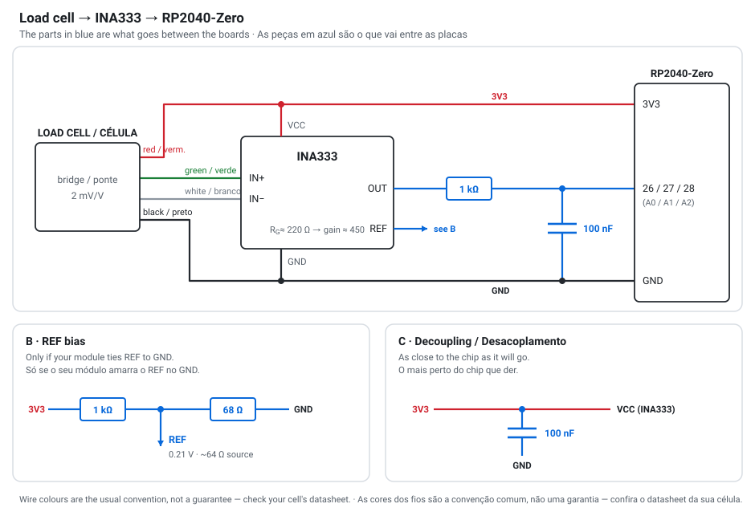

# Pedal wiring — sensors, amplifiers and what goes between / Ligação da pedaleira — sensores, amplificadores e o que vai no meio

**🇬🇧 [English](#-english) · 🇧🇷 [Português](#-português)**

> Power every amplifier at **3.3 V, never 5 V**. The RP2040 pins are not 5 V tolerant and the
> amplifier output drives one of them directly.
>
> Alimente todo amplificador em **3,3 V, nunca 5 V**. Os pinos do RP2040 não toleram 5 V e a saída
> do amplificador vai direto num deles.

---

## 🇬🇧 English

### The three paths

The board reads one sensor per pedal, and the firmware picks how to read it by `sensor_type`
(the `Pot | Hall | HX711 | Amp` chips in DriveLab Studio). Only two of the four need parts between
the sensor and the board.

| Sensor | In the app | Enters through | Parts in between |
|---|---|---|---|
| Potentiometer | `Pot` | ADC pin | none |
| Analog Hall | `Hall` | ADC pin | none |
| Load cell + HX711 | `HX711` | two digital pins | none — the module does everything |
| Load cell + instrumentation amp (INA333) | `Amp` | ADC pin | **an RC filter, and usually a REF divider** |

The ADC pins are the only four on the board that read voltage:

| Pedal | Board pin | Arduino name |
|---|---|---|
| Clutch | `26` | `A0` |
| Brake | `27` | `A1` |
| Throttle | `28` | `A2` |
| — | `29` | `A3` (free) |

Pins `0`–`15` are digital only. That is why the HX711 lives on `GP2`–`GP7`: it does not waste the
four pins that can measure voltage.

---

### Path A — load cell + instrumentation amplifier (INA333 / CJMCU-333)

This is the path worth taking on the **brake**, where response speed matters. Recommended for the
brake; pot or Hall is enough for clutch and throttle, which measure travel and not force.

<p align="center"></p>

#### What goes between, and why

**The cell has four wires, but only two enter the amplifier.** This is the difference that trips up
everyone coming from the HX711. The HX711 excites the bridge itself; an instrumentation amplifier
does not. The excitation wires (usually red and black) go straight to the board's `3V3` and `GND`,
and only the signal pair (green and white) reaches `IN+`/`IN-`.

Feeding the bridge from the same `3V3` that the ADC uses as its reference is deliberate: when the
supply drifts, signal and reference drift together and most of the error cancels. The RP2040-Zero
has no separate `ADC_VREF` pin, so this is free accuracy.

| Part | Where | Why it is there |
|---|---|---|
| **1 kΩ** | in series, amp `OUT` → board ADC pin | with the 100 nF it forms a low-pass at ~1.6 kHz, and it limits the current into the pin if the output ever exceeds 3.3 V |
| **100 nF** | from the ADC pin to `GND` | the other half of that filter; kills switching noise before it becomes a reading |
| **1 kΩ + 68 Ω** | divider from `3V3` to `GND`, midpoint to `REF` | lifts the resting output to ~0.2 V |
| **100 nF** | across the module's `VCC` and `GND` | decoupling, as close to the chip as you can get it |

**Why the REF divider matters more than it looks.** On a single 3.3 V supply the output cannot go
below zero. Every load cell has some resting imbalance, and it can be negative. If `REF` sits at
`GND`, that imbalance pins the output at the bottom and you lose the start of pedal travel — the
brake does nothing for the first centimetre and then wakes up. Lifting `REF` to ~0.2 V puts the
resting point safely inside the range. The divider values give about 64 Ω of source impedance,
which is low enough that the amplifier's noise rejection barely notices.

Check your module first: some CJMCU-333 boards expose `REF` on a pin, some tie it to `GND`, and
some already have an offset trimmer. If yours has the trimmer, use it and skip the divider.

#### Can it work without these parts?

**Yes — start without any of them.** The cell, the module and four wires are enough to see the axis
move. The module already carries the gain trimmer and, on most boards, its own supply capacitor.
Wire it bare, watch the raw value in DriveLab Studio, and add parts **against a symptom you actually
see** rather than on faith.

| Part | Can you skip it? | What you give up |
|---|---|---|
| 1 kΩ + 100 nF | Yes, to begin with | The reading jitters — the last digits dance with your foot off the pedal. You also lose the only thing limiting current into the ADC pin if the output ever goes above 3.3 V. |
| REF divider | Maybe — it is a coin flip | If the cell's resting imbalance happens to push the output up, nothing happens and you never need it. If it pushes down, the output sits against zero and the first part of the pedal travel is dead. |
| 100 nF decoupling | Usually | Most CJMCU boards already have one next to the chip. Check yours before adding a second. |
| Gain resistor | No | But it is the trimmer already fitted to the module, so you are not buying anything. |

The order that wastes least: wire it bare → set the gain with the trimmer → if the start of travel
is dead, add the REF divider → if the value is restless at rest, add the RC. Three of the four parts
cost under a real each, so buying them up front is also fine; the point is that none of them block
you from testing today.

#### Choosing the gain resistor

The INA333 gain is set by one resistor: **G = 1 + 100 kΩ / R<sub>G</sub>**.

A 2 mV/V cell excited at 3.3 V produces about **6.6 mV** at its rated load. To turn that into ~3 V
you need a gain near 450, so R<sub>G</sub> ≈ **220 Ω**. Most CJMCU modules ship with a trimpot in
that position — fine for finding the value, but a trimpot on a brake pedal vibrates and drifts.
Once you know the number, replace it with a fixed 0.1% resistor.

Tune it against the real pedal, not the datasheet: set a starting gain, press as hard as you ever
will in a race, and watch the raw value in DriveLab Studio. If it pins at 4095 before your hardest
press, the gain is too high. If your hardest press only reaches 1500, raise it. You are aiming for
your maximum force to land near the top of the range without ever touching it, because an amplifier
that saturates does not clip gracefully.

#### Optional, for long or noisy cable runs

1 kΩ in series with each of `IN+` and `IN-`, plus 10 nF between them, forms an RFI filter at the
amplifier's input. It is genuinely useful when the cell sits far from the amplifier — but the right
fix is to not let that happen. Mount the module **at the cell**. The entire reason an instrumentation
amplifier exists is to lift the signal before it travels: 6 mV crossing 60 cm of cable collects every
bit of noise in the room; 3 V collects none.

---

### Path B — load cell + HX711

```
   LOAD CELL                    HX711 module              RP2040-Zero
  ┌─────────┐  red   ─────────► E+                 VCC ──── 3V3
  │         │  green ─────────► A+                 GND ──── GND
  │ bridge  │  white ─────────► A-                 DT  ────► GP2 / GP4 / GP6
  │         │  black ─────────► E-                 SCK ◄──── GP3 / GP5 / GP7
  └─────────┘
```

**Nothing goes between.** The HX711 amplifies and converts on the spot and hands the board a number
over two digital wires — a home-grown protocol, not I²C or SPI: the board pulses `SCK` 25 times and
the HX711 drops one of its 24 bits on `DT` per pulse.

| Pedal | DT | SCK |
|---|---|---|
| Clutch | `GP2` | `GP3` |
| Brake | `GP4` | `GP5` |
| Throttle | `GP6` | `GP7` |

The one thing to check before buying: the HX711 has two sample rates, 10 or 80 readings per second,
selected by a pin on the chip. Most ready-made modules ship tied to the slow one. **10 Hz means a
new brake value every 100 ms**, which reads as lag and steps on a brake pedal. See whether your
module lets you jumper the fast mode. Even 80 Hz will be the slowest link in the pedal set.

---

### Path C — potentiometer or Hall

```
   3V3 ──── one end
                       wiper ────► board pin 26 / 27 / 28
   GND ──── other end
```

Nothing in between. A potentiometer measures position, its output is volts already, and it does not
drift, so it needs neither amplifier nor tare.

---

### Rules that apply to every path

**One common ground.** Board, amplifier and cell share `GND`. A load cell reading against a
different ground reference reads noise.

**3.3 V, never 5 V.** Repeated because it is the mistake that kills boards. Plenty of tutorials
power the HX711 at 5 V; its data pin then drives 5 V into an RP2040 pin that tolerates 3.3 V.

**If a load-cell pedal always reads zero, swap the two signal wires.** A cell wired backwards does
not read inverted — it reads dead. The firmware clamps negatives to zero, so a reversed cell looks
exactly like a broken one.

**Do not press the pedal while plugging the cable in.** Both load-cell paths tare on boot, so
whatever force is applied at that moment becomes the new zero.

**With nothing wired, the ADC inputs float and the axes read noise.** That is normal, not a fault.

---

### What this document does not know

**The pin order on your module's silkscreen.** The maps above are `function → function`; where each
one physically sits on the header is the manufacturer's decision. Read the silkscreen before you
solder.

**Which CJMCU-333 variant you bought.** Some are laid out for a split supply and bring `V+`, `V-`
and `GND` separately. Tying `V-` to `GND` works, but then the `REF` bias stops being optional.

**Your cell's actual sensitivity.** 2 mV/V is the common figure, not a guarantee. If yours differs,
the gain resistor changes with it — which is why the tuning method above beats the arithmetic.

**Whether `GP29` is truly free on your board.** The RP2040-Zero breaks it out where a Raspberry Pi
Pico spends it on internal sensing, so a fourth analog axis looks possible. Confirm against
Waveshare's schematic before you design around it.

---

## 🇧🇷 Português

### Os três caminhos

A placa lê um sensor por pedal, e o firmware escolhe **como** ler pelo `sensor_type` (os chips
`Pot | Hall | HX711 | Amp` no DriveLab Studio). Só dois dos quatro precisam de peças entre o sensor
e a placa.

| Sensor | No app | Entra por | Peças no meio |
|---|---|---|---|
| Potenciômetro | `Pot` | pino do ADC | nenhuma |
| Hall analógico | `Hall` | pino do ADC | nenhuma |
| Célula + HX711 | `HX711` | dois pinos digitais | nenhuma — o módulo faz tudo |
| Célula + amplificador de instrumentação (INA333) | `Amp` | pino do ADC | **um filtro RC, e em geral um divisor no REF** |

Os pinos do ADC são os únicos quatro da placa que leem tensão:

| Pedal | Pino na placa | Nome Arduino |
|---|---|---|
| Embreagem | `26` | `A0` |
| Freio | `27` | `A1` |
| Acelerador | `28` | `A2` |
| — | `29` | `A3` (livre) |

Os pinos `0`–`15` são só digitais. É por isso que o HX711 mora no `GP2`–`GP7`: não desperdiça os
quatro pinos que sabem medir tensão.

---

### Caminho A — célula de carga + amplificador de instrumentação (INA333 / CJMCU-333)

É o caminho que vale a pena no **freio**, onde a velocidade de resposta importa. Recomendado para o
freio; para embreagem e acelerador, potenciômetro ou Hall bastam — eles medem curso, não força.

<p align="center"></p>

#### O que vai no meio, e por quê

**A célula tem quatro fios, mas só dois entram no amplificador.** É a diferença que confunde todo
mundo que vem do HX711. O HX711 alimenta a ponte sozinho; o amplificador de instrumentação não. Os
fios de excitação (em geral vermelho e preto) vão direto no `3V3` e no `GND` da placa, e só o par de
sinal (verde e branco) chega no `IN+`/`IN-`.

Alimentar a ponte pelo mesmo `3V3` que o ADC usa como referência é de propósito: quando a tensão
oscila, sinal e referência oscilam juntos e a maior parte do erro se cancela. A RP2040-Zero não tem
pino `ADC_VREF` separado, então isso é precisão de graça.

| Peça | Onde | Por que está ali |
|---|---|---|
| **1 kΩ** | em série, `OUT` do amp → pino do ADC | com os 100 nF forma um passa-baixa em ~1,6 kHz, e limita a corrente no pino se a saída passar de 3,3 V |
| **100 nF** | do pino do ADC para o `GND` | a outra metade do filtro; mata ruído de chaveamento antes de virar leitura |
| **1 kΩ + 68 Ω** | divisor do `3V3` para o `GND`, meio no `REF` | levanta o repouso da saída para ~0,2 V |
| **100 nF** | entre `VCC` e `GND` do módulo | desacoplamento, o mais perto do chip que der |

**Por que o divisor do REF importa mais do que parece.** Com alimentação simples de 3,3 V a saída
não consegue ir abaixo de zero. Toda célula tem um desequilíbrio de repouso, e ele pode ser
negativo. Se o `REF` estiver no `GND`, esse desequilíbrio encosta a saída no fundo e você perde o
começo do curso — o freio não faz nada no primeiro centímetro e depois acorda. Levantar o `REF`
para ~0,2 V põe o repouso com folga dentro da faixa. Os valores do divisor dão uns 64 Ω de
impedância, baixo o bastante para a rejeição de ruído do amplificador quase não sentir.

Confira o seu módulo antes: alguns CJMCU-333 expõem o `REF` num pino, alguns amarram no `GND`, e
alguns já trazem um trimpot de offset. Se o seu tem o trimpot, use ele e pule o divisor.

#### Dá para funcionar sem essas peças?

**Dá — comece sem nenhuma delas.** A célula, o módulo e quatro fios já bastam para ver o eixo se
mexer. O módulo já traz o trimpot de ganho e, na maioria das placas, o próprio capacitor de
alimentação. Ligue pelado, olhe o valor bruto no DriveLab Studio, e acrescente peça **contra um
sintoma que você viu**, não por fé.

| Peça | Dá para pular? | O que você abre mão |
|---|---|---|
| 1 kΩ + 100 nF | Sim, para começar | A leitura fica inquieta — os últimos dígitos dançam com o pé fora do pedal. E some a única coisa que limita corrente no pino do ADC se a saída passar de 3,3 V. |
| Divisor do REF | Talvez — é cara ou coroa | Se o desequilíbrio de repouso da célula empurrar a saída para cima, não acontece nada e você nunca precisa dele. Se empurrar para baixo, a saída encosta no zero e o começo do curso do pedal fica morto. |
| 100 nF de desacoplamento | Em geral sim | A maioria das placas CJMCU já tem um ao lado do chip. Confira a sua antes de pôr um segundo. |
| Resistor de ganho | Não | Mas ele é o trimpot que já veio no módulo, então você não vai comprar nada. |

A ordem que desperdiça menos: ligar pelado → acertar o ganho no trimpot → se o começo do curso
estiver morto, pôr o divisor do REF → se o valor ficar inquieto em repouso, pôr o RC. Três das
quatro peças custam menos de um real cada, então comprar tudo de uma vez também serve; o ponto é que
nenhuma delas impede você de testar hoje.

#### Escolhendo o resistor de ganho

O ganho do INA333 sai de um resistor só: **G = 1 + 100 kΩ / R<sub>G</sub>**.

Uma célula de 2 mV/V excitada em 3,3 V entrega cerca de **6,6 mV** na carga nominal. Para virar ~3 V
você precisa de ganho perto de 450, então R<sub>G</sub> ≈ **220 Ω**. A maioria dos módulos CJMCU vem
com um trimpot nessa posição — serve para achar o valor, mas trimpot em pedal de freio vibra e
desregula. Descoberto o número, troque por um resistor fixo de 0,1%.

Ajuste contra o pedal real, não contra o datasheet: escolha um ganho inicial, pise com toda a força
que você usaria numa corrida, e olhe o valor bruto no DriveLab Studio. Se ele grudar em 4095 antes
da sua pisada mais forte, o ganho está alto. Se a pisada mais forte só chega a 1500, suba. A mira é
a sua força máxima cair perto do topo da faixa sem nunca encostar, porque amplificador que satura
não corta de forma elegante.

#### Opcional, para cabo longo ou ambiente ruidoso

1 kΩ em série em cada entrada, `IN+` e `IN-`, mais 10 nF entre elas, formam um filtro de RF na
entrada do amplificador. É útil de verdade quando a célula fica longe do amplificador — mas o
conserto certo é não deixar isso acontecer. Monte o módulo **junto da célula**. A razão de existir
um amplificador de instrumentação é levantar o sinal antes de ele viajar: 6 mV atravessando 60 cm de
cabo recolhem todo o ruído do ambiente; 3 V não recolhem nada.

---

### Caminho B — célula de carga + HX711

```
   CÉLULA                       módulo HX711              RP2040-Zero
  ┌─────────┐  verm.  ────────► E+                 VCC ──── 3V3
  │         │  verde  ────────► A+                 GND ──── GND
  │  ponte  │  branco ────────► A-                 DT  ────► GP2 / GP4 / GP6
  │         │  preto  ────────► E-                 SCK ◄──── GP3 / GP5 / GP7
  └─────────┘
```

**Não vai nada no meio.** O HX711 amplifica e converte ali mesmo e entrega um número para a placa
por dois fios digitais — um protocolo caseiro, não é I²C nem SPI: a placa pulsa o `SCK` 25 vezes e o
HX711 solta um dos seus 24 bits no `DT` a cada pulso.

| Pedal | DT | SCK |
|---|---|---|
| Embreagem | `GP2` | `GP3` |
| Freio | `GP4` | `GP5` |
| Acelerador | `GP6` | `GP7` |

A única coisa a conferir antes de comprar: o HX711 tem duas taxas de amostragem, 10 ou 80 leituras
por segundo, escolhidas por um pino do chip. A maioria dos módulos prontos vem amarrada na lenta.
**10 Hz significa valor novo de freio a cada 100 ms**, o que se sente como atraso e degrau num pedal
de freio. Veja se o seu módulo deixa jumpear o modo rápido. Mesmo 80 Hz vai ser o elo mais lento da
pedaleira.

---

### Caminho C — potenciômetro ou Hall

```
   3V3 ──── uma ponta
                       cursor ────► pino 26 / 27 / 28 da placa
   GND ──── outra ponta
```

Nada no meio. Potenciômetro mede posição, a saída dele já é tensão, e ele não deriva — então não
precisa nem de amplificador nem de tara.

---

### Regras que valem para todos os caminhos

**Um terra comum.** Placa, amplificador e célula compartilham o `GND`. Célula medindo contra uma
referência de terra diferente lê ruído.

**3,3 V, nunca 5 V.** Repetido porque é o erro que mata placa. Muito tutorial alimenta o HX711 em
5 V; aí o pino de dados dele empurra 5 V num pino de RP2040 que tolera 3,3 V.

**Se um pedal de célula ler sempre zero, inverta os dois fios de sinal.** Célula ligada ao contrário
não fica invertida — fica morta. O firmware corta negativo em zero, então célula invertida parece
exatamente uma célula quebrada.

**Não pise no pedal enquanto pluga o cabo.** Os dois caminhos de célula fazem tara no boot, então a
força aplicada nesse instante vira o novo zero.

**Sem nada ligado, as entradas do ADC ficam flutuando e os eixos leem ruído.** Isso é normal, não é
defeito.

---

### O que este documento NÃO sabe

**A ordem dos pinos na serigrafia do seu módulo.** Os mapas acima são `função → função`; onde cada
uma fica fisicamente no header é decisão do fabricante. Leia a serigrafia antes de soldar.

**Qual variante de CJMCU-333 você comprou.** Algumas são desenhadas para fonte simétrica e trazem
`V+`, `V-` e `GND` separados. Amarrar o `V-` no `GND` funciona, mas aí o `REF` levantado deixa de
ser opcional.

**A sensibilidade real da sua célula.** 2 mV/V é o número comum, não uma garantia. Se a sua for
diferente, o resistor de ganho muda junto — que é justamente por que o método de ajuste acima vale
mais que a conta.

**Se o `GP29` está mesmo livre na sua placa.** A RP2040-Zero expõe ele onde um Raspberry Pi Pico o
gasta com medição interna, então um quarto eixo analógico parece possível. Confirme no esquemático
da Waveshare antes de projetar em cima disso.
