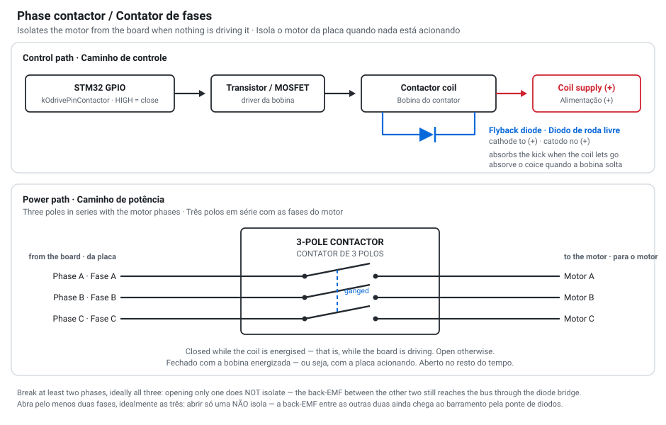

# DriveLab — Soft-power / Contactor Guide · Guia do Contator (proteção off-state)

**🇬🇧 [English](#-english) · 🇧🇷 [Português](#-português)**

> ⚠️ **Status: groundwork (firmware pronto e opt-in, NÃO validado em bancada com hardware real).**
> O firmware está implementado e **desligado por padrão** (`soft_power_enable = 0` → placa igual a
> hoje). A fiação do contator e a validação ainda são passo de bancada. O **pino GPIO é um
> placeholder (`PC6`) — CONFIRME o pino real do header antes de fiar.** Faça a montagem com cuidado.

---

## 🇬🇧 English

### What it does & why
When the board is **off**, spinning the motor by hand makes it act as a generator (back-EMF). That
voltage is **rectified by the MOSFETs' body diodes** straight onto the DC bus → charges the bus
capacitors → a hard spin can over-volt the board. The **contactor physically disconnects the motor
phases when the board isn't driving**, so the back-EMF has nowhere to go. It's the off-state
protection a firmware brake-resistor can't provide (the chopper needs firmware running).

### How it works
- **Contactor = normally-open (NO), 3-pole**, on the motor phases (A/B/C). **Coil energized = CLOSED**
  (phases connected). **No power = OPEN** → *fail-safe*: board off = phases isolated, automatically.
- **Firmware state machine** (`ContactorManager`): `OPEN → CLOSING → CLOSED → OPENING`. It **closes**
  when the firmware wants to drive the motor (calibration / spring / game FFB) and **opens** when
  idle or on a fault.
- **`readyToDrive()` gate:** the motor is only energized once the contactor is **physically closed**
  (never drive into an open phase).
- **Anti-arc:** the firmware **disarms the motor before** opening the contactor → it opens with no
  current flowing. (On a raw power-loss the FOC dies at the same instant, so any arc is negligible.)

### Daily use (end user) — it's automatic
Once wired and enabled, the **end user does NOT interact with the contactor directly — it's
transparent.** The firmware drives it based on whether the motor is armed:
1. **Turn the rig on** (power switch/supply — or, in the future, a soft-power button). The board boots.
2. **When you start using it** (the wheel arms/calibrates to play), the firmware **closes the
   contactor** — you'll hear a **"click"** and FFB starts working. From then on it's **invisible**.
3. **Turn it off / stop using it** → the firmware **disarms the motor and opens the contactor**
   (another "click").
4. **With the board off, the wheel is FREE** — you can turn it by hand with no resistance **and no
   risk to the board** (this is the protection: spinning the wheel while off no longer dumps energy
   into the bus).

**What the end user does:** just **power the rig on/off**. Nothing contactor-specific. The
`soft_power_enable` setting is a **one-time setup** (by whoever builds the wheel), not a daily
control. **Signs it's working:** the contactor's **click** on arm/disarm, and the **free, safe
wheel** when off.

> The full "power on → game → FFB" daily flow depends on the M6 motor/FFB path (currently blocked on
> the magnetic encoder). The contactor's automatic part works once wired + enabled. A **soft-power
> button** (tap-to-on / hold-to-off, Moza-style) is a **future layer**; today on/off is the power switch.

### Opt-in setting (default = off)
- App → **Hardware tab** (advanced mode: run with `-- --advanced` or an `advanced.flag` file) →
  **`soft_power_enable`**: **0 = as today** (no contactor logic, no GPIO touched), **1 = contactor active**.
- **Default is 0** — boards without a contactor keep working unchanged.

### ⚠️ Enabling: set 1 → Save → REBOOT the board
1. In the Hardware tab, set `soft_power_enable = 1` and **Save**. The app writes it to the board
   (RAM + flash).
2. **Power-cycle the board.** The contactor GPIO is initialized at boot, so the setting only fully
   engages after a restart (the persisted value is read on boot).
3. **Gotcha:** with the contactor wired **and the setting left at 0**, the coil never energizes →
   the contactor stays **OPEN** → the motor won't run (phases isolated). If you wired the contactor,
   **you must set `soft_power_enable = 1`** (and reboot).

### Hardware you need
- **Contactor / relay, normally-open (NO), 3-pole (or at least 2 poles)** — rated for your motor's
  **PEAK phase current** (a DD draws tens of amps) **and** the bus voltage. A small signal relay is
  NOT enough; use a proper power contactor/relay.
- **A coil driver** — a board GPIO (3.3 V, milliamps) **cannot** drive a contactor coil directly.
  Use an **NPN transistor or logic-level MOSFET** (or a ready relay-driver module): GPIO → base/gate;
  the coil is powered from its own rail (e.g. 12 V, per the coil's spec).
- **A flyback diode** across the coil (cathode to +, anode to the switched side) — absorbs the
  inductive kick when the coil de-energizes; protects the driver transistor.

### Wiring (concept)

- Break **at least 2 phases** (ideally all 3): opening only one phase does NOT isolate — the
  back-EMF between the other two still reaches the bus through the diode bridge.
- The **GPIO pin** is `kOdrivePinContactor` in the firmware (currently a **placeholder `PC6`** —
  confirm the real free GPIO on your board's header and set it before flashing).
- Firmware drives the pin **HIGH = coil on = closed**, **LOW = coil off = open**.

### Safety
- **Fail-safe:** NO contactor → power loss opens it → phases isolated when off. ✔
- **Never switch under load:** the firmware sequences it (close before driving, open after disarm) —
  don't add anything that toggles the coil while the motor is driving (arc / welded contacts).
- **Rate for the peak**, not the continuous current. A welded/under-rated contactor is dangerous.
- The DC-bus **brake resistor** still handles regen while the board is **on**; the contactor covers
  the **off** state. They're complementary.

### Status / caveats
- Firmware: implemented, gated by `soft_power_enable`, **build-verified only** — not yet validated
  with a real contactor on the bench.
- The **GPIO pin is a placeholder** — confirm and set it.
- "Apply live" (engage without a reboot) is a possible future tweak; today it's **set 1 → Save →
  reboot**.

---

## 🇧🇷 Português

### O que faz e por quê
Com a placa **desligada**, girar o motor na mão o transforma em gerador (back-EMF). Essa tensão é
**retificada pelos diodos internos dos MOSFETs** direto pro barramento DC → carrega os capacitores →
um giro brusco pode dar sobretensão na placa. O **contator desconecta fisicamente as fases do motor
quando a placa não está dirigindo**, então a back-EMF não tem pra onde ir. É a proteção do estado
**desligado** que o brake resistor por firmware não cobre (o chopper precisa do firmware rodando).

### Como funciona
- **Contator = normalmente-aberto (NO), 3 polos**, nas fases do motor (A/B/C). **Bobina energizada =
  FECHADO** (fases conectadas). **Sem energia = ABERTO** → *fail-safe*: placa desligada = fases
  isoladas, automático.
- **Máquina de estados no firmware** (`ContactorManager`): `OPEN → CLOSING → CLOSED → OPENING`.
  **Fecha** quando o firmware quer dirigir o motor (calibração / mola / FFB do jogo); **abre** quando
  em repouso (idle) ou em falha.
- **Trava `readyToDrive()`:** o motor só é energizado depois que o contator está **fisicamente
  fechado** (nunca dirige numa fase aberta).
- **Anti-arco:** o firmware **desarma o motor antes** de abrir o contator → ele abre **sem corrente**.
  (Numa queda de energia crua, o FOC morre no mesmo instante, então o arco é desprezível.)

### Uso no dia a dia (usuário final) — é automático
Depois de fiado e ativado, o **usuário final NÃO interage com o contator diretamente — é
transparente.** O firmware o comanda conforme o motor está armado ou não:
1. **Liga o rig** (chave/fonte — ou, no futuro, um botão soft-power). A placa boota.
2. **Ao começar a usar** (o volante arma/calibra pra jogar), o firmware **fecha o contator** — você
   ouve um **"clique"** e o FFB passa a funcionar. Daí em diante é **invisível**.
3. **Desliga / para de usar** → o firmware **desarma o motor e abre o contator** (outro "clique").
4. **Com a placa desligada, o volante fica LIVRE** — dá pra girar na mão sem resistência **e sem
   risco pra placa** (é aqui a proteção: girar o volante desligado não joga mais energia no
   barramento).

**O que o usuário final faz:** só **ligar/desligar** o rig. Nada específico do contator. O setting
`soft_power_enable` é **setup de UMA vez** (por quem monta o volante), não um controle do dia a dia.
**Sinais de que funciona:** o **clique** do contator ao armar/desarmar, e o **volante livre e
seguro** quando desligado.

> O fluxo completo "liga → jogo → FFB" depende do caminho de motor/FFB do M6 (hoje travado no encoder
> magnético). A parte automática do contator já funciona uma vez fiado + ativado. Um **botão
> soft-power** (toque liga / segura desliga, estilo Moza) é uma **camada futura**; hoje o on/off é a
> chave/fonte.

### Setting opt-in (default = desligado)
- App → aba **Hardware** (modo avançado: rodar com `-- --advanced` ou um arquivo `advanced.flag`) →
  **`soft_power_enable`**: **0 = como hoje** (nenhuma lógica de contator, nenhum GPIO tocado),
  **1 = contator ativo**.
- **O padrão é 0** — placas sem contator seguem funcionando igual.

### ⚠️ Ativando: setar 1 → Salvar → REINICIAR a placa
1. Na aba Hardware, coloque `soft_power_enable = 1` e **Salve**. O app grava na placa (RAM + flash).
2. **Reinicie a placa** (power-cycle). O GPIO do contator é inicializado no **boot**, então o setting
   só engata de fato **depois do reinício** (o valor persistido na flash é lido no boot).
3. **Pegadinha:** com o contator fiado **e o setting em 0**, a bobina nunca energiza → o contator
   fica **ABERTO** → o motor não gira (fases isoladas). Se você fiou o contator, **tem que setar
   `soft_power_enable = 1`** (e reiniciar).

### Hardware necessário
- **Contator / relé, normalmente-aberto (NO), 3 polos (ou pelo menos 2)** — dimensionado pro
  **PICO de corrente de fase** do seu motor (um DD puxa dezenas de amperes) **e** pra tensão do
  barramento. Relé de sinal pequeno NÃO serve; use um contator/relé de potência.
- **Um driver da bobina** — um GPIO da placa (3,3 V, miliamperes) **não** aciona a bobina do contator
  direto. Use um **transistor NPN ou MOSFET nível-lógico** (ou um módulo relé-driver pronto): GPIO →
  base/gate; a bobina é alimentada por um trilho próprio (ex.: 12 V, conforme a bobina).
- **Um diodo de roda-livre (flyback)** em paralelo com a bobina — absorve o pico indutivo quando a
  bobina desliga; protege o transistor.

### Fiação (conceito)

- Abra **pelo menos 2 fases** (ideal as 3): abrir só uma fase **NÃO** isola — a back-EMF entre as
  outras duas ainda chega ao barramento pela ponte de diodos.
- O **pino GPIO** é o `kOdrivePinContactor` no firmware (hoje um **placeholder `PC6`** — confirme o
  GPIO livre real do header da sua placa e ajuste antes de gravar).
- O firmware aciona o pino **HIGH = bobina ligada = fechado**, **LOW = bobina desligada = aberto**.

### Segurança
- **Fail-safe:** contator NO → queda de energia abre → fases isoladas quando desligado. ✔
- **Nunca chavear sob carga:** o firmware sequencia (fecha antes de dirigir, abre depois de
  desarmar) — não adicione nada que ligue/desligue a bobina com o motor dirigindo (arco / contato
  solda).
- **Dimensione pro PICO**, não pra corrente contínua. Um contator subdimensionado/soldado é perigoso.
- O **brake resistor** do barramento continua cobrindo a regen com a placa **ligada**; o contator
  cobre o estado **desligado**. São complementares.

### Status / ressalvas
- Firmware: implementado, gated por `soft_power_enable`, **validado só em build** — ainda não testado
  com um contator real na bancada.
- O **pino GPIO é placeholder** — confirme e ajuste.
- "Aplicar ao vivo" (engatar sem reiniciar) é um ajuste possível no futuro; hoje é **setar 1 →
  Salvar → reiniciar**.

---

DriveLab — Autor: Luciano Tomé — Licença MIT
