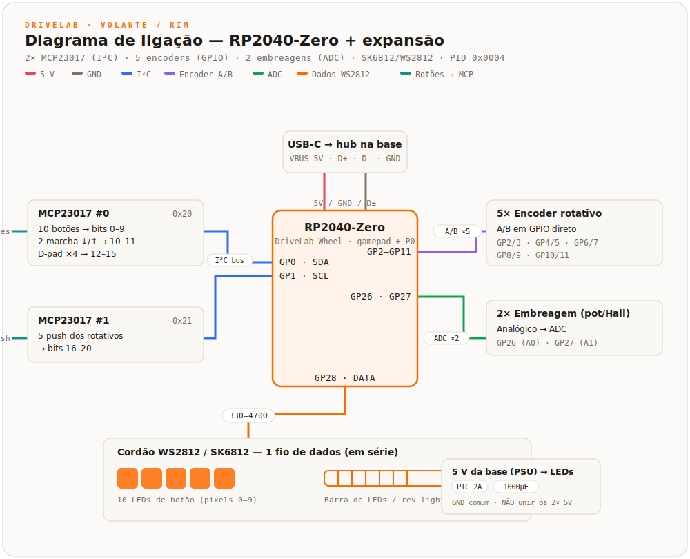

# DriveLab Firmware — Volante removível / rim (RP2040)

Firmware do **rim DriveLab** (o aro com botões, pás e LEDs) — placa **Waveshare RP2040-Zero**,
dispositivo USB HID **próprio** (PID `0x1209:0x0004`), enumera como **"DriveLab Wheel"**.

<a href="#-english">🇬🇧 English</a> &nbsp;·&nbsp; <a href="#-português">🇧🇷 Português</a>

---

## 🇬🇧 English

Firmware for the **DriveLab rim** (the wheel face with buttons, paddles and LEDs) — **Waveshare RP2040-Zero** board,
a **custom** USB HID device (PID `0x1209:0x0004`), enumerates as **"DriveLab Wheel"**.
Design/decisions: internal project notes (not versioned in the public repo).

> RP2040 + **arduino-pico** (Philhower) + Adafruit_TinyUSB + Adafruit_NeoPixel. MIT license.
> **Status (2026-07):** enumeration + **vendor P0 channel validated on real hardware** (Waveshare RP2040-Zero) — enumerates as **"DriveLab Wheel"** (VID `0x1209` / PID `0x0004`), joystick streams, and settings read/write works on the wire (read LedBright=128 → write 42 → read 42, the `0x16` fix confirmed). **Still to validate with the rim wired:** the MCP23017 button reads, encoders, clutch ADC, and the WS2812 LEDs — none were connected on the bench. App-side note: a `HidWheelTransport` doesn't exist yet, so the Studio can't drive the real rim until that's added.

### Two HID channels
1. **Gamepad** (report `0x01`): 32 buttons + 2 axes (clutch paddles). What games read.
2. **Vendor P0** (64 bytes): `WheelState 0x21` (telemetry), `WheelLed 0x18` (colors),
   `SettingWrite/ReadReq/Value 0x14/0x15/0x16`, `Command 0x02`. What DriveLab Studio uses.

### Milestones
- **M1** Gamepad HID: buttons (matrix + shift paddles) + 2 clutch axes (ADC) + encoders-as-buttons. Visible in `joy.cpl`.
- **M2** Vendor P0: `WheelState` (button + paddle bitmap), `Command`, `Settings`, paddle calibration.
- **M3** WS2812 LEDs: `WheelLed` applies colors; brightness/count via setting.
- **M4** Flash: `SaveToFlash` persists paddle calibration + LED config **including the per-button predefined colors** (magic "DLW2"); loads on boot and the rim lights up with the saved colors on its own (no app needed). The app **reads the stored colors back** on connect via a `RequestLeds` command → `LedValue 0x19` reply (the rim is the source of truth for its colors).

### Rim I/O & pin map (tunable at the top of main.cpp)
Target rim: **10 push buttons (each RGB-lit)**, **5 rotary encoders** (with push), **4 paddles** (2 clutch + 2 shift/gears), a **D-pad** (directional buttons), and a **LED bar** (rev lights). On an RP2040-Zero the 5 encoders already eat 10 GPIOs, so the ~21 slow buttons go on **two MCP23017 I²C expanders** (32 inputs on 2 pins). BOM adds **2× MCP23017** (~US$1.5 each).

- **I²C (MCP23017 ×2):** SDA `GP0`, SCL `GP1` — addresses `0x20` (#0) and `0x21` (#1). **Power the expanders at 3.3 V** (from the RP2040 `3V3` pin), **not 5 V** — the RP2040 GPIOs are not 5 V-tolerant, so a 5 V SDA/SCL would damage them. Buttons wire pin → `GND` (internal pull-ups).
- **MCP #0** (16 in): 10 push buttons → bits 0–9 · gears down/up → bits 10–11 · D-pad U/D/L/R → bits 12–15.
- **MCP #1** (5 in used): the 5 rotary pushes → bits 16–20.
- **Encoders A/B (direct GPIO):** `GP2/3, GP4/5, GP6/7, GP8/9, GP10/11` — CW → bits 21–25, CCW → bits 26–30 (momentary).
- **Clutches (ADC):** `GP26` (left), `GP27` (right) — analog, for progressive clutch + bite point.
- **WS2812 data:** `GP28` — one chained strand: **pixels 0–9 = the 10 button LEDs, then the LED bar** (`ledCount` = 10 + bar, a P0 setting).
- **Button RGB LED (chosen): SK6812** (WS2812-compatible addressable) — one per button, e.g. a reverse-mount **SK6812-E** behind a translucent **~15–16 mm low-profile momentary cap** (KS-style feel). All LEDs (buttons + bar) daisy-chain on the single GP28 data line — the firmware drives them unchanged.

> 32-button gamepad report: 31 buttons used (bit 31 spare) + 2 clutch axes. Games read it directly; the app drives the RGB over the P0 `WheelLed` (0x18) channel.

**Wiring diagram** (block/bus view — exact per-pin detail is the table above):

*Interactive, theme-aware version: [`docs/wiring.html`](docs/wiring.html) (open locally).*

**Bill of materials (rim)**

| Qty | Part | Notes |
|----:|------|-------|
| 1 | **Waveshare RP2040-Zero** | the rim MCU (USB-C, tiny). Firmware = this repo. |
| 2 | **MCP23017 I²C expander board** | addresses `0x20` + `0x21` (set A0/A1/A2). **Power at 3.3 V.** |
| 10 | **SK6812** (e.g. SK6812-E, reverse-mount) | one RGB LED per button, behind a translucent momentary cap (~15–16 mm). |
| ~8–16 | **WS2812/SK6812** | the LED bar (rev lights), chained after the buttons. |
| 5 | **rotary encoder** (with push) | A/B on `GP2–GP11`; push on MCP #1. |
| 2 | **pot or Hall sensor** | clutch paddles → ADC `GP26`/`GP27`. |
| 10+ | **momentary buttons** | 10 push + 2 gears + D-pad, into the MCP23017s. |
| 1 | **330–470 Ω resistor** | in series on the WS2812 data line. |
| 1 | **PTC ~2–2.5 A** + **1000 µF cap** | on the `5V_LED` rail (see power section). |

> Only for a **full (RGB) rim**. A simple rim (no LEDs) skips the SK6812/LED-bar/PTC/cap.

### Wheel ↔ base wiring & power (simple vs full rim)

You can build the rim at two levels — pick before wiring the quick-release:

- **Simple rim (no LEDs)** — buttons, encoders and clutch paddles only. The RP2040 + inputs draw a few tens of mA, so the whole rim runs **straight off USB VBUS**. Across the rotating joint you only need the **4 USB wires**: `VBUS (5V)`, `D+`, `D−`, `GND`. Nothing else.
- **Full rim (RGB buttons + LED bar)** — the WS2812s can pull **~1.5 A** (26 LEDs × ~60 mA at full white), far above any USB port's budget (0.5 A USB 2.0 / 0.9 A USB 3). **Do NOT power the LEDs from USB VBUS** — the current limit is the same whether the rim plugs into the PC directly or through the base. Feed the LEDs from a **dedicated 5 V rail taken from the base's own power supply** (a buck converter off the ODESC's 24/56 V). The base has the power budget; USB does not.

**Routing through the base (recommended).** The base holds a small **USB hub** (ODESC + rim share a single cable to the PC) and a **5 V buck** off the main PSU. Because the RP2040 lives **in the rim**, only these cross the quick-release (QR) + **slip ring**:

| Signal | Source | Notes |
|---|---|---|
| `D+`, `D−`, `GND` | hub | USB data — 12 Mb/s Full-Speed, tolerant of a decent slip ring |
| `VBUS (5V)` | hub | powers **only the RP2040 logic** (~tens of mA) |
| `5V_LED`, `GND` | base 5 V buck | powers **only the WS2812s** — size the conductor for ~2 A |

Keep logic on USB VBUS and LEDs on the base's 5 V, and **never tie the two 5 V rails together** (two sources fighting). They share **GND only**. A simple rim uses just the first two rows (the 4 USB wires).

**Protections (full rim):**
- **Common ground** between USB GND and the base 5 V GND — mandatory (data reference + LED return current).
- **Resettable fuse (PTC ~2–2.5 A)** on the `5V_LED` rail — guards against a LED short or slip-ring fault.
- **Bulk capacitor ~1000 µF** across 5 V/GND right next to the WS2812s on the rim — absorbs inrush/spikes.
- **~330–470 Ω series resistor** on the WS2812 **data** line (at the first pixel) — damps ringing.
- **Level note:** the RP2040 drives WS2812 data at 3.3 V — usually fine, but a 3.3→5 V level shifter improves reliability on long strands.
- **Firmware safety net:** the `ledBrightness` P0 setting caps worst-case current even if full white is requested.
- **Slip ring:** gold contacts; keep the power pair separate from the data pair; short USB run between slip ring and hub; don't hot-swap the QR under LED load.

### ⚠️ Written without a board — check on the bench first
1. **Vendor P0 response — ✅ already fixed (2026-07).** The `0x16` (SettingValue) response is now **queued in `onSetReport` and sent from `loop()` with priority over the gamepad**, and the payload is ≤ 63 bytes — the same fix applied to `firmware-pedal`/`firmware-handbrake` (TinyUSB's single HID endpoint drops the 2nd report sent back-to-back, so settings reads would fail if `0x16` went straight from the callback). Still to confirm on real hardware once the rim is wired.
2. **TinyUSB OUTPUT reports** (`onSetReport`): reception of `WheelLed`/`SettingWrite` — suspect #1 (same as pedal/handbrake).
3. **Report descriptor** (gamepad + vendor) visible to Windows/HidSharp.
4. **Byte-layout** matching `DriveLab.Core` 1:1 (`WheelState`, `WheelLedReport`).
5. WS2812 timing vs. USB.

### How to flash/validate (future M5)
- BOOTSEL → build/upload in PlatformIO. `joy.cpl` shows "DriveLab Wheel" (32 buttons + 2 axes).
- DriveLab Studio (once the rim transport exists) reads telemetry and sends colors.

---

## 🇧🇷 Português

Firmware do **rim DriveLab** (o aro com botões, pás e LEDs) — placa **Waveshare RP2040-Zero**,
dispositivo USB HID **próprio** (PID `0x1209:0x0004`), enumera como **"DriveLab Wheel"**.
Design/decisões: notas internas de projeto (não versionadas no repo público).

> RP2040 + **arduino-pico** (Philhower) + Adafruit_TinyUSB + Adafruit_NeoPixel. Licença MIT.
> **Status (2026-07):** enumeração + **canal vendor P0 validados em hardware real** (Waveshare RP2040-Zero) — enumera como **"DriveLab Wheel"** (VID `0x1209` / PID `0x0004`), o joystick transmite, e a leitura/escrita de settings funciona no fio (read LedBright=128 → write 42 → read 42, fix do `0x16` confirmado). **Falta validar com o aro montado:** a leitura dos botões via MCP23017, os encoders, o ADC das embreagens e os LEDs WS2812 — nada foi ligado na bancada. Nota do app: ainda não existe um `HidWheelTransport`, então o Studio não controla o aro real até isso ser adicionado.

### Dois canais HID
1. **Gamepad** (report `0x01`): 32 botões + 2 eixos (pás de embreagem). O que os jogos leem.
2. **Vendor P0** (64 bytes): `WheelState 0x21` (telemetria), `WheelLed 0x18` (cores),
   `SettingWrite/ReadReq/Value 0x14/0x15/0x16`, `Command 0x02`. O que o DriveLab Studio usa.

### Marcos
- **M1** Gamepad HID: botões (matriz + pás de shift) + 2 eixos de embreagem (ADC) + encoders-como-botões. Visível no `joy.cpl`.
- **M2** Vendor P0: `WheelState` (bitmap de botões + pás), `Command`, `Settings`, calibração das pás.
- **M3** LEDs WS2812: `WheelLed` aplica cores; brilho/contagem por setting.
- **M4** Flash: `SaveToFlash` persiste calibração das pás + config de LED **incluindo as cores pré-definidas de cada botão** (magic "DLW2"); carrega no boot e o aro acende sozinho com as cores salvas (sem precisar do app). O app **lê as cores de volta** ao conectar, via comando `RequestLeds` → resposta `LedValue 0x19` (o aro é a fonte da verdade das próprias cores).

### Entradas do aro & mapa de pinos (ajustável no topo do main.cpp)
Aro alvo: **10 botões de pressão (cada um com LED RGB)**, **5 encoders rotativos** (com push), **4 pás** (2 embreagem + 2 marcha), um **D-pad** (botões direcionais) e uma **barra de LEDs** (rev lights). Na RP2040-Zero os 5 encoders já consomem 10 GPIOs, então os ~21 botões lentos vão em **dois expanders I²C MCP23017** (32 entradas em 2 pinos). BOM acrescenta **2× MCP23017** (~US$1,5 cada).

- **I²C (MCP23017 ×2):** SDA `GP0`, SCL `GP1` — endereços `0x20` (#0) e `0x21` (#1). **Alimente os expanders em 3,3 V** (do pino `3V3` do RP2040), **não 5 V** — os GPIO do RP2040 não são 5 V-tolerantes, então SDA/SCL em 5 V os danificaria. Botões ligam pino → `GND` (pull-ups internos).
- **MCP #0** (16 in): 10 botões de pressão → bits 0–9 · marcha down/up → bits 10–11 · D-pad cima/baixo/esq/dir → bits 12–15.
- **MCP #1** (5 in usados): os 5 push dos rotativos → bits 16–20.
- **Encoders A/B (GPIO direto):** `GP2/3, GP4/5, GP6/7, GP8/9, GP10/11` — CW → bits 21–25, CCW → bits 26–30 (momentâneos).
- **Embreagens (ADC):** `GP26` (esq.), `GP27` (dir.) — analógico, para embreagem progressiva + bite point.
- **WS2812 (dados):** `GP28` — um cordão em série: **pixels 0–9 = os 10 LEDs dos botões, depois a barra de LEDs** (`ledCount` = 10 + barra, um setting P0).
- **LED RGB do botão (escolhido): SK6812** (endereçável, compatível com WS2812) — um por botão, ex.: **SK6812-E** reverse-mount atrás de uma **capa momentânea de baixo perfil translúcida ~15–16 mm** (feel estilo KS). Todos os LEDs (botões + barra) encadeiam na única linha de dados GP28 — o firmware aciona sem mudança.

> Report de gamepad com 32 botões: 31 usados (bit 31 sobra) + 2 eixos de embreagem. Os jogos leem direto; o app manda as cores RGB pelo canal P0 `WheelLed` (0x18).

**Diagrama de ligação** (visão de blocos/barramentos — o detalhe pino-a-pino está na tabela acima):

*Versão interativa (tema claro/escuro): [`docs/wiring.html`](docs/wiring.html) (abrir localmente).*

**Lista de materiais (aro)**

| Qtd | Peça | Observações |
|----:|------|-------------|
| 1 | **Waveshare RP2040-Zero** | o MCU do aro (USB-C, minúsculo). Firmware = este repo. |
| 2 | **Placa expander MCP23017 (I²C)** | endereços `0x20` + `0x21` (setar A0/A1/A2). **Alimentar em 3,3 V.** |
| 10 | **SK6812** (ex. SK6812-E, reverse-mount) | um LED RGB por botão, atrás de capa momentânea translúcida (~15–16 mm). |
| ~8–16 | **WS2812/SK6812** | a barra de LEDs (rev lights), encadeada após os botões. |
| 5 | **encoder rotativo** (com push) | A/B em `GP2–GP11`; push no MCP #1. |
| 2 | **pot ou sensor Hall** | pás de embreagem → ADC `GP26`/`GP27`. |
| 10+ | **botões momentâneos** | 10 de pressão + 2 marcha + D-pad, nos MCP23017. |
| 1 | **resistor 330–470 Ω** | em série na linha de dados do WS2812. |
| 1 | **PTC ~2–2,5 A** + **cap 1000 µF** | no trilho `5V_LED` (ver seção de energia). |

> Só para um **aro completo (RGB)**. Um aro simples (sem LED) dispensa SK6812/barra/PTC/cap.

### Interligação com a base & alimentação (aro simples vs completo)

Dá pra montar o aro em dois níveis — decida antes de fiar o engate rápido:

- **Aro simples (sem LED)** — só botões, encoders e pás de embreagem. O RP2040 + entradas puxam poucas dezenas de mA, então o aro inteiro roda **direto do VBUS do USB**. Cruzando a junta rotativa você só precisa dos **4 fios de USB**: `VBUS (5V)`, `D+`, `D−`, `GND`. Nada mais.
- **Aro completo (botões RGB + barra de LEDs)** — os WS2812 podem puxar **~1,5 A** (26 LEDs × ~60 mA no branco máximo), muito acima do teto de qualquer porta USB (0,5 A no USB 2.0 / 0,9 A no USB 3). **NÃO alimente os LEDs pelo VBUS do USB** — o limite de corrente é o mesmo, quer o aro plugue direto no PC ou passe pela base. Alimente os LEDs por um **trilho de 5 V dedicado, tirado da fonte da própria base** (um buck a partir dos 24/56 V da ODESC). A base tem a folga de corrente; o USB não.

**Passando pela base (recomendado).** A base guarda um pequeno **hub USB** (ODESC + aro dividem um único cabo pro PC) e um **buck de 5 V** a partir do PSU principal. Como o RP2040 fica **no aro**, só isto cruza o engate rápido (QR) + **slip ring**:

| Sinal | Origem | Observações |
|---|---|---|
| `D+`, `D−`, `GND` | hub | dados USB — 12 Mb/s Full-Speed, tolerante a um slip ring decente |
| `VBUS (5V)` | hub | alimenta **só a lógica do RP2040** (~dezenas de mA) |
| `5V_LED`, `GND` | buck de 5 V da base | alimenta **só os WS2812** — dimensione o condutor p/ ~2 A |

Mantenha a lógica no VBUS do USB e os LEDs no 5 V da base, e **nunca ligue os dois trilhos de 5 V juntos** (duas fontes brigando). Eles compartilham **só o GND**. Um aro simples usa só as duas primeiras linhas (os 4 fios de USB).

**Proteções (aro completo):**
- **GND comum** entre o GND do USB e o GND do 5 V da base — obrigatório (referência dos dados + retorno da corrente dos LEDs).
- **Fusível rearmável (PTC ~2–2,5 A)** no trilho `5V_LED` — protege contra curto de LED ou falha do slip ring.
- **Capacitor bulk ~1000 µF** entre 5 V/GND bem perto dos WS2812 no aro — absorve inrush/picos.
- **Resistor série ~330–470 Ω** na linha de **dados** do WS2812 (no 1º pixel) — amortece ringing.
- **Nota de nível:** o RP2040 aciona os dados do WS2812 em 3,3 V — costuma funcionar, mas um level shifter 3,3→5 V melhora a confiabilidade em cordões longos.
- **Rede de segurança no firmware:** o setting P0 `ledBrightness` limita o pior caso de corrente mesmo que peçam branco total.
- **Slip ring:** contatos dourados; separe o par de potência do par de dados; cabo USB curto entre o slip ring e o hub; não troque o QR a quente com os LEDs sob carga.

### ⚠️ Escrito sem placa — conferir primeiro na bancada
1. **Resposta do vendor P0 — ✅ já corrigido (jul/2026).** A resposta `0x16` (SettingValue) agora é **enfileirada no `onSetReport` e enviada do `loop()` com prioridade sobre o gamepad**, com payload ≤ 63 bytes — o mesmo fix aplicado em `firmware-pedal`/`firmware-handbrake` (o endpoint HID único do TinyUSB dropa o 2º report back-to-back, então a leitura de settings falharia se o `0x16` saísse direto do callback). Falta confirmar em hardware real quando o aro estiver montado.
2. **OUTPUT reports do TinyUSB** (`onSetReport`): recepção de `WheelLed`/`SettingWrite` — suspeito nº1 (igual pedal/handbrake).
3. **Report descriptor** (gamepad + vendor) visível ao Windows/HidSharp.
4. **Byte-layout** casando 1:1 com `DriveLab.Core` (`WheelState`, `WheelLedReport`).
5. Timing WS2812 vs. USB.

### Como gravar/validar (futuro M5)
- BOOTSEL → build/upload no PlatformIO. `joy.cpl` mostra "DriveLab Wheel" (32 botões + 2 eixos).
- DriveLab Studio (quando o transport do rim existir) lê telemetria e manda cores.
