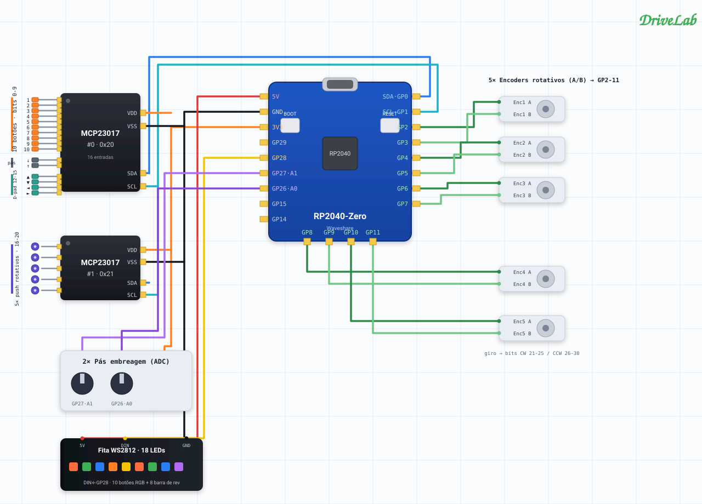
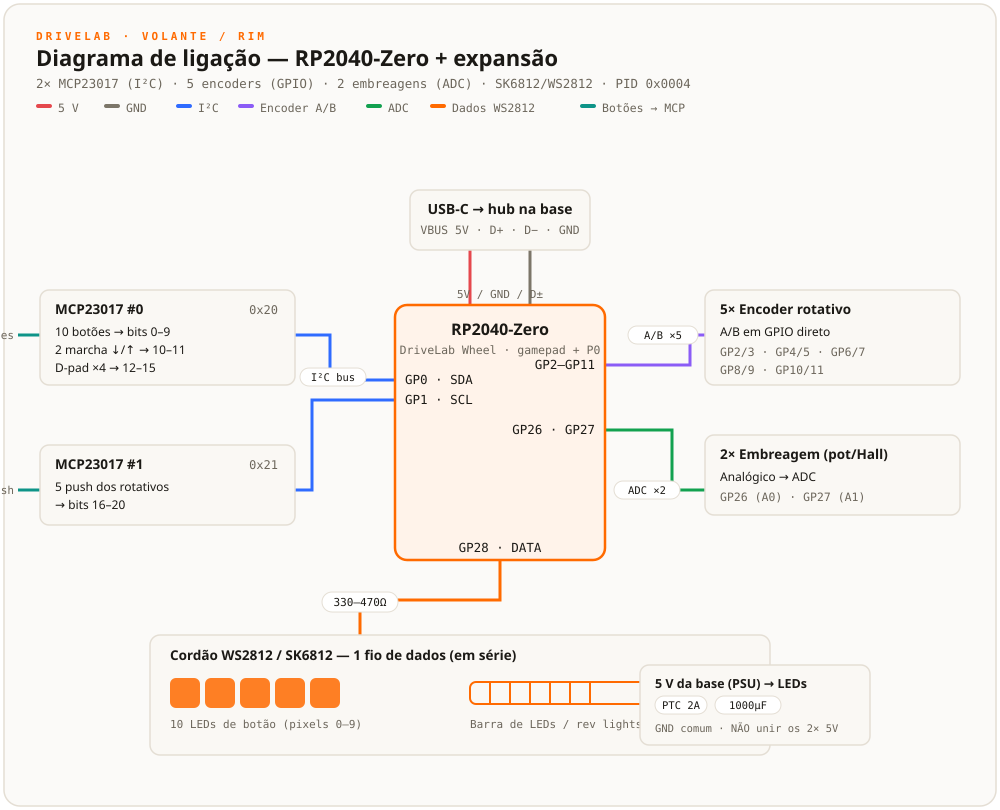

# DriveLab Firmware — Aro do volante (RP2040)

Firmware do **aro DriveLab** — a face do volante, com botões, pás e LEDs. Placa **Waveshare RP2040-Zero**, dispositivo USB HID próprio (`0x1209:0x0004`), enumerando como **"DriveLab Wheel"**.

<p align="center"><a href="README.md">🇬🇧 Read in English</a></p>

---

> **Status (julho/2026): parcialmente validado.** A enumeração e o canal vendor P0 estão **confirmados em hardware real** — aparece como "DriveLab Wheel", o joystick transmite, e a leitura e gravação de ajustes funciona no fio. **Ainda não validados:** a leitura dos botões pelos MCP23017, os encoders, o ADC das embreagens e os LEDs WS2812 — nada foi ligado na placa na bancada. Do lado do app, ainda não existe um `HidWheelTransport`, então o DriveLab Studio não controla um aro real até isso ser feito.

Stack: RP2040 + **arduino-pico** (Philhower) + **Adafruit_TinyUSB** + **Adafruit_NeoPixel**. MIT.

## Dois canais HID

1. **Gamepad** (report `0x01`) — 32 botões + 2 eixos (as pás de embreagem). É o que os jogos leem.
2. **Vendor P0** (64 bytes) — telemetria `WheelState 0x21`, cores `WheelLed 0x18`, ajustes `0x14`/`0x15`/`0x16`, `Command 0x02`. É o que o DriveLab Studio usa.

O aro é **dono das próprias cores**: elas ficam salvas na flash (magic `"DLW2"`) junto com a calibração das pás, então ele acende sozinho ao ligar, sem app nenhum rodando. O app lê elas de volta ao conectar, por `RequestLeds` → `LedValue 0x19`.

## O que o aro tem

10 botões de pressão (cada um com LED RGB), 5 encoders rotativos com push, 4 pás (2 de embreagem + 2 de marcha), um D-pad, e uma barra de LEDs para as rev lights.

Os 5 encoders já consomem 10 GPIOs de uma RP2040-Zero, então os ~21 botões lentos vão em **dois expansores I²C MCP23017** — 32 entradas ao custo de 2 pinos.

## Mapa de pinos

Ajustável no topo do `main.cpp`.

| O quê | Pinos | Observações |
|---|---|---|
| **I²C** (os dois MCP23017) | SDA `GP0`, SCL `GP1` | endereços `0x20` e `0x21` |
| **MCP #0** (16 entradas) | — | 10 botões de pressão → bits 0–9 · marcha baixo/cima → bits 10–11 · D-pad → bits 12–15 |
| **MCP #1** (5 usadas) | — | os 5 push dos encoders → bits 16–20 |
| **Encoders A/B** | `GP2/3`, `GP4/5`, `GP6/7`, `GP8/9`, `GP10/11` | horário → bits 21–25, anti-horário → bits 26–30 (momentâneos) |
| **Pás de embreagem** | `GP26`, `GP27` | analógicas — embreagem progressiva + bite point |
| **Dados do WS2812** | `GP28` | um cordão só: pixels 0–9 são os LEDs dos botões, depois vem a barra |

> ⚠️ **Alimente os expansores MCP23017 em 3,3 V**, pelo pino `3V3` do RP2040 — **não em 5 V**. Os GPIOs do RP2040 não toleram 5 V, e 5 V no SDA/SCL danifica eles. Os botões ligam pino → `GND` e usam os pull-ups internos.

O report de gamepad carrega 32 botões (31 usados, um sobrando) mais os 2 eixos de embreagem. Os jogos leem isso direto; o app manda as cores RGB pelo canal P0 `WheelLed`.

**Diagrama de ligação** — cada peça desenhada individualmente, com os fios A/B de cada encoder:



*Versão interativa, com tema claro e escuro: [`docs/wiring-pictorial.html`](docs/wiring-pictorial.html) (abrir localmente).*

<details><summary>Visão de blocos e barramentos (resumo compacto)</summary>



*Interativa: [`docs/wiring.html`](docs/wiring.html). O detalhe pino a pino está na tabela acima.*

</details>

## Lista de materiais

| Qtd | Peça | Observações |
|----:|------|-------------|
| 1 | **Waveshare RP2040-Zero** | o MCU do aro (USB-C, minúsculo). |
| 2 | **Placa expansora MCP23017 (I²C)** | endereços `0x20` + `0x21` (setar A0/A1/A2). **Alimentar em 3,3 V.** |
| 10 | **SK6812** (ex.: SK6812-E, reverse-mount) | um LED RGB por botão, atrás de uma capa momentânea translúcida (~15–16 mm). |
| ~8–16 | **WS2812/SK6812** | a barra de LEDs (rev lights), encadeada depois dos botões. |
| 5 | **encoder rotativo** (com push) | A/B em `GP2`–`GP11`; push no MCP #1. |
| 2 | **potenciômetro ou sensor Hall** | pás de embreagem → `GP26` / `GP27`. |
| 10+ | **botões momentâneos** | 10 de pressão + 2 de marcha + D-pad, nos MCP23017. |
| 1 | **resistor 330–470 Ω** | em série na linha de dados do WS2812. |
| 1 | **PTC ~2–2,5 A** + **capacitor 1000 µF** | no trilho `5V_LED` — veja abaixo. |

> Só para um **aro completo (RGB)**. Um aro simples, sem LEDs, dispensa os SK6812, a barra, o PTC e o capacitor.

## Alimentar o aro — leia antes de fiar o engate rápido

Dá para montar o aro em dois níveis, e a escolha muda o que precisa cruzar a junta rotativa.

**Aro simples (sem LEDs)** — só botões, encoders e pás de embreagem. O RP2040 e as entradas puxam poucas dezenas de miliampères, então o aro inteiro roda direto do `VBUS` do USB. Cruzando a junta você precisa só dos **4 fios de USB**: `VBUS`, `D+`, `D−`, `GND`.

**Aro completo (botões RGB + barra de LEDs)** — os WS2812 podem puxar **~1,5 A** (26 LEDs no branco máximo), muito além do teto de qualquer porta USB (0,5 A no USB 2.0, 0,9 A no USB 3). **Não alimente os LEDs pelo `VBUS` do USB.** Esse limite é o mesmo, quer o aro pluge direto no PC ou passe pela base. Alimente eles por um **trilho de 5 V dedicado, tirado da fonte da própria base** — um conversor buck a partir do barramento de 24/56 V. A base tem folga de corrente; o USB não.

**Passando pela base (recomendado).** A base guarda um pequeno hub USB, então a base e o aro dividem um cabo só até o PC, mais um buck de 5 V a partir da fonte principal. Como o RP2040 fica no aro, só isto cruza o engate rápido e o slip ring:

| Sinal | Origem | Observações |
|---|---|---|
| `D+`, `D−`, `GND` | hub | dados USB — 12 Mb/s full speed, tolerante a um slip ring decente |
| `VBUS (5V)` | hub | alimenta **só a lógica do RP2040** (dezenas de mA) |
| `5V_LED`, `GND` | buck de 5 V da base | alimenta **só os WS2812** — dimensione o condutor para ~2 A |

Mantenha a lógica no `VBUS` do USB e os LEDs no 5 V da base, e **nunca ligue os dois trilhos de 5 V juntos** — isso é duas fontes brigando. Eles compartilham **só o `GND`**.

**Proteções para um aro completo:**

- **Terra comum** entre o `GND` do USB e o `GND` do 5 V da base — obrigatório. Ele é ao mesmo tempo a referência dos dados e o caminho de retorno dos LEDs.
- **Fusível rearmável (PTC ~2–2,5 A)** no trilho `5V_LED` — cobre um LED em curto ou uma falha do slip ring.
- **Capacitor de reservatório ~1000 µF** entre 5 V e `GND`, bem perto dos WS2812, no aro — absorve o pico de partida e os transientes.
- **Resistor série de 330–470 Ω** na linha de **dados** do WS2812, no primeiro pixel — amortece o ringing.
- **Nota de nível:** o RP2040 aciona a linha de dados em 3,3 V. Costuma funcionar, mas um level shifter 3,3→5 V é mais confiável em cordões longos.
- **Rede de segurança no firmware:** o ajuste `ledBrightness` limita a corrente de pior caso mesmo que alguém peça branco total.
- **Slip ring:** contatos dourados, par de potência longe do par de dados, cabo USB curto entre o slip ring e o hub, e nunca troque o engate rápido a quente com os LEDs sob carga.

## Compilar e gravar

Precisa do [PlatformIO](https://platformio.org). Estão definidos dois ambientes — `rp2040_zero` (a placa alvo) e `pico`.

```bash
cd firmware-wheel
pio run                             # compila os dois ambientes
pio run -e rp2040_zero -t upload    # gravar
```

Segure **BOOT** e toque **RESET** para cair no bootloader UF2, e então grave.

Conferir se deu certo: o `joy.cpl` no Windows mostra **"DriveLab Wheel"** com 32 botões e 2 eixos.

## Nota de implementação — o endpoint HID único

Mesma limitação dos firmwares de pedal e freio de mão: o TinyUSB tem um só endpoint HID e descarta o segundo de dois reports em sequência. Por isso o payload vendor tem **63 bytes**, e a resposta `0x16` é **enfileirada no `onSetReport` e enviada do `loop()` com prioridade sobre o gamepad**, nunca direto do callback. Confirmado no fio aqui (ler brilho 128 → gravar 42 → ler 42).

---

O firmware da base é outro bicho — STM32F405, em [`../firmware-base/`](../firmware-base/README.pt.md). O contrato USB-HID completo está em [`../docs/PROTOCOL.md`](../docs/PROTOCOL.md).
